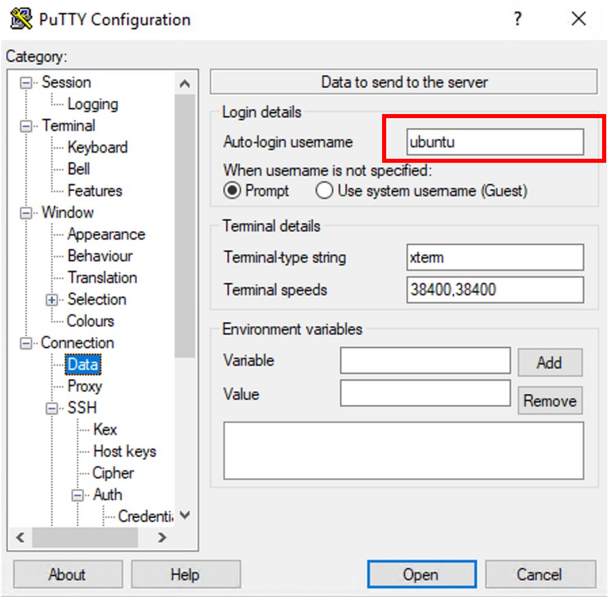
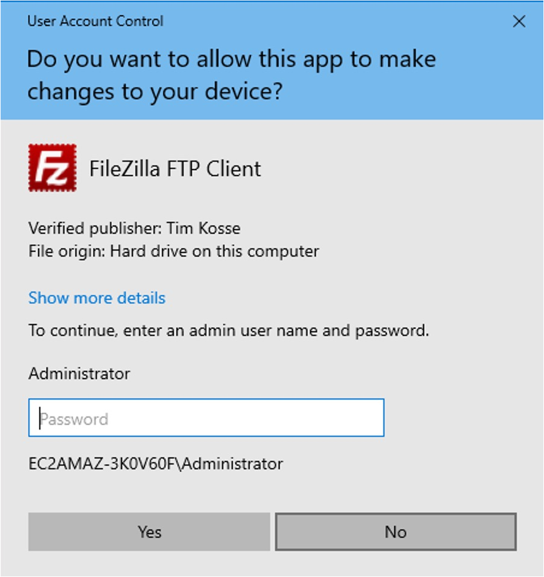
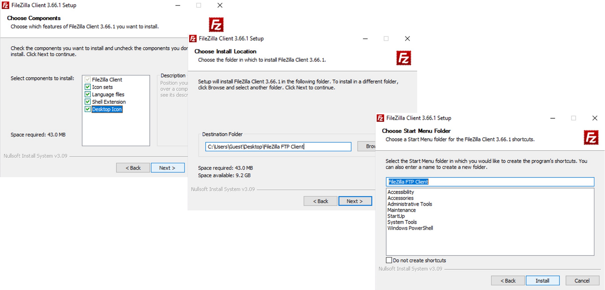
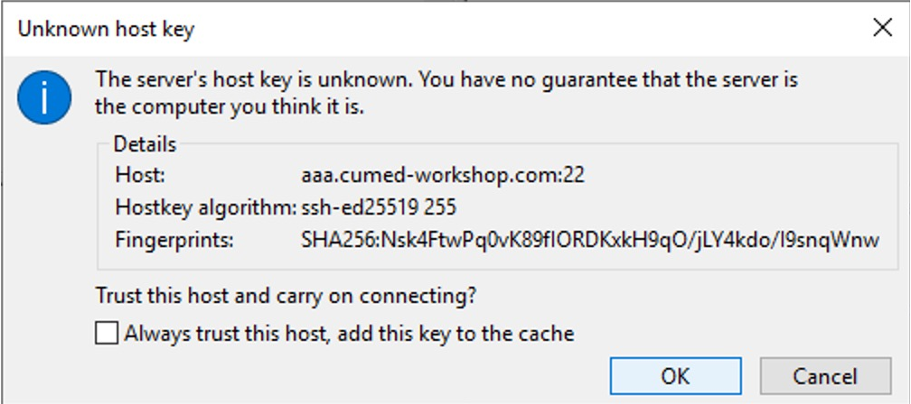

- [AWS EC2 instance and key pairs](#aws-ec2-instance-and-key-pairs)
- [Access workshop EC2 server (VNC + Ubuntu Xfce desktop)](#access-workshop-ec2-server-vnc--ubuntu-xfce-desktop)
  - [Windows OS](#windows-os)
    - [1. Coverting key pair (.pem) to Putty (.ppk) format](#1-coverting-key-pair-pem-to-putty-ppk-format)
    - [2. Connecting to EC2 workshop server using Putty](#2-connecting-to-ec2-workshop-server-using-putty)
    - [3. Connecting to Ubuntu desktop using RealVNC](#3-connecting-to-ubuntu-desktop-using-realvnc)
  - [Linux/MacOS](#linuxmacos)
    - [MacOS user VNC to EC2 server](#macos-user-vnc-to-ec2-server)
    - [Linux user VNC to EC2 server](#linux-user-vnc-to-ec2-server)
- [Pre-installed visualization tools for viewing pipeline results](#pre-installed-visualization-tools-for-viewing-pipeline-results)
  - [`scp` for Linux/MacOS user](#scp-for-linuxmacos-user)
  - [FileZilla client for Windows user](#filezilla-client-for-windows-user)


## AWS EC2 instance and key pairs

This workshop will be conducted using [AWS EC2](https://docs.aws.amazon.com/AWSEC2/latest/UserGuide/concepts.html) instances. For each attendee, you will have your own EC2 instance with DNS name `server_$(printf "%03d" N).cumed-workshop.com`, where `N` is the rank on the registration list. E.g., if a attendee is ranked 1st on the list, the EC2 server assigned to him/her will be `server_001.cumed-workshop.com`. 

To access a AWS EC instance, attendee needs AWS [key pairs](https://docs.aws.amazon.com/AWSEC2/latest/UserGuide/create-key-pairs.html#having-ec2-create-your-key-pair), which has already been created. 

<!--Attendee-specific EC2 server address and key pairs has already been sent to him/her through **registration email**.-->

Attendee-specific EC2 server address and key pairs will be delivered on the day of workshop.

## Access workshop EC2 server (VNC + Ubuntu Xfce desktop)

Workshop servers use Ubuntu 22.04 LTS with Xfce lightweight desktop env. After `ssh` to the server, attendees could use [VNC](https://en.wikipedia.org/wiki/Virtual_Network_Computing) to access the Xfce graphical desktop.

### Windows OS

For Windows users, please download putty/puttygen [binaries](https://www.chiark.greenend.org.uk/~sgtatham/putty/latest.html):

For X64 (64-bit x86) system (most user should use this one):
>https://the.earth.li/~sgtatham/putty/latest/w64/putty.exe
>https://the.earth.li/~sgtatham/putty/latest/w64/puttygen.exe

For other architecture, please find corresponding binaries [here](https://www.chiark.greenend.org.uk/~sgtatham/putty/latest.html).

#### 1. Coverting key pair (.pem) to Putty (.ppk) format

Double click puttygen binary downloaded and refer to section: **Convert your private key using PuTTYgen**.

Please follow the step-by-step instructions below:

1. Load .pem key.

<p align="left">

</p>

<p align="left">

</p>

2. Save private key in .ppk format.

<p align="left">

</p>


#### 2. Connecting to EC2 workshop server using Putty

1. Specify host name.

<p align="left">

</p>

2. Left "Category" panel: "Connection" -> "SSH" -> "Auth" -> "Credentials"

<p align="left">

</p>

3. Enable port forwarding for VNC.

<p align="left">

</p>

4. Specify login user name.

<p align="left">

</p>

5. Click "open" to connect (Please choose "connect once" in the subsequent window, so putty will not save current host keys, which will cause some problem in current workshop AWS settings: dynamic IP for the EC2 instance).

<p align="left">

</p>

_PS: after login to server, please also set up a fresh VNC session:_

```bash
vncserver -kill :1
vncserver -localhost -geometry 1600x1200
```

#### 3. Connecting to Ubuntu desktop using RealVNC

Attendee could download a standalone binary of RealVNC client without installation (e.g., X64 system): https://downloads.realvnc.com/download/file/viewer.files/VNC-Viewer-7.8.0-Windows-64bit.exe. Other architectures, please check the [download page](https://www.realvnc.com/en/connect/download/viewer/windows/). While connecting to the remote server using VNC through "localhost:5901", please **keep the putty ssh session alive**.

<p align="left">

</p>

And click "continue" to proceed:

<p align="left">

</p>

Password is "ubuntu":

<p align="left">

</p>

### Linux/MacOS

For Linux/MacOS users, please download the key pairs: `cumed_user_key.pem`and change permission:

```bash
curl -O https://raw.githubusercontent.com/liu-xingliang/cumed_workshop/main/00.prerequisites/cumed_user_key.pem
chmod 400 cumed_user_key.pem
```

After that, user could access their EC2 server with (e.g., for user 001), _please specify correct path of the key pair_:

```bash
rm ~/.ssh/known_host # clean saved known host keys to avoid some problems in current workshop AWS settings: dynamic IP for the EC2 instance
ssh -i ~/Downloads/linux_EC2_key.pem -L 5901:localhost:5901 -o StrictHostKeyChecking=no ubuntu@aaa.cumed-workshop.com 
```

The `-L 5901:localhost:5901` part is to enable port forwarding to map local port 5901 to remote port 5901 upon which VNC server is listening. 

#### MacOS user VNC to EC2 server 

While keep the above ssh session alive. Attendees simply go "Finder" -> "Go" -> "Connect to Server" -> "localhost:5901" -> password: "ubuntu".

<p align="left">

</p>

#### Linux user VNC to EC2 server

Similar to Windows OS, attendees could also use standalone RealVNC client for Linux here: https://downloads.realvnc.com/download/file/viewer.files/VNC-Viewer-7.8.0-Linux-x64.

## Pre-installed visualization tools for viewing pipeline results

Attendees might want to view intermediate and final results of pipelines during workshop. Though workshop EC2 servers come with a few visualization utilies:
* Bash shell tools: `less`, `more`, etc.  
* [samtools view](https://www.htslib.org/doc/samtools-view.html). All `samtools` can be accessed through pre-installed workshop conda environment:

```bash
mamba activate cumed_workshop
samtools --version
samtools view -h
```

* [IGV](https://igv.org/doc/desktop/). It is located on the graphical desktop of workshop EC2 server.

However, attendees might still want to pull down files from workshop server to local for futher examination.

### `scp` for Linux/MacOS user 

Linux/MacOS command line users could use SSH based file copy protocals (`scp`), which is included in most Linux/MacOS distributions:

```bash
# Please don't overlook the "." at the end of the command
# This will pull down the file to the current directory of local file system
scp -i ~/Downloads/linux_EC2_key.pem -o StrictHostKeyChecking=no ubuntu@aaa.cumed-workshop.com:/you/file/path .
```

### FileZilla client for Windows user

Window users can use sftp protocal with (FileZilla)(https://filezilla-project.org/) client.

For example, x64 system can download installation file from [here](https://filezilla-project.org/download.php?platform=win64). If attendees use a lab PC without "Administrator" access, they can still install FZ:

1. Initiate the installation.

<p align="left">

</p>

2. Admin access is not required, please select "No".

<p align="left">

</p>

3. Only install for "me".

<p align="left">

</p>

4. Specify a local folder to which current non-Admin user has access (e.g., Desktop).

<p align="left">

</p>

5. Setup a "New Site" (e.g., "cumed_workshop"):

* Use "SFTP" protocal.
* Specify host name.
* Logon type: "Key file".
* User: "ubuntu"
* Select .ppk key file we used for Putty ssh session.

<p align="left">

</p>

6. Please uncheck the box for NOT saving host key, as it might cause some problem in current workshop AWS settings (dynamic IP for the EC2 instance).

<p align="left">

</p>

7. Direct to the target directory on the right panel and download (drag-and-drop is supported) selected files.

<p align="left">

</p>


