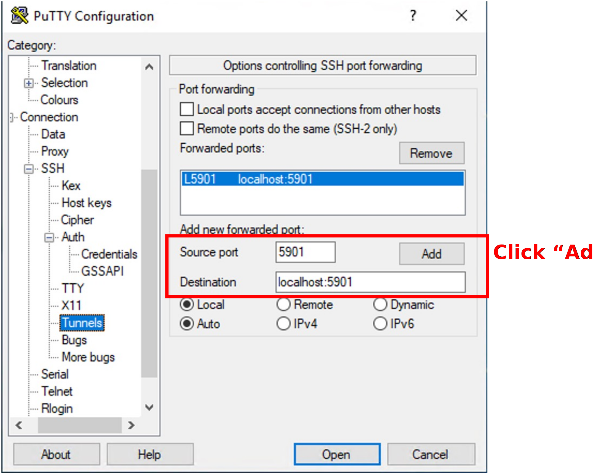

- [Download AWS EC2 private key](#download-aws-ec2-private-key)
- [Access workshop EC2 server](#access-workshop-ec2-server)
  - [0. Download Putty](#0-download-putty)
  - [1. Connecting to EC2 workshop server using Putty](#1-connecting-to-ec2-workshop-server-using-putty)
  - [2. Connecting to Ubuntu desktop using RealVNC](#2-connecting-to-ubuntu-desktop-using-realvnc)
  - [(Optional) FileZilla client](#optional-filezilla-client)


## Download AWS EC2 private key

Please use [cumed_user_key.ppk](https://github.com/liu-xingliang/cumed_workshop/blob/main/00.prerequisites/keys/cumed_user_key.ppk) uploaded to workshop github repository (click the link and download file using top-right corner button indicated below in red box).

<p align="left">

</p>

## Access workshop EC2 server

### 0. Download Putty

Download: [putty](https://the.earth.li/~sgtatham/putty/latest/w64/putty.exe) to your desktop and open it.

### 1. Connecting to EC2 workshop server using Putty

1. Specify host name: server_XXX.cumed-workshop.com.

<p align="left">

</p>

2. Left "Category" panel: "Connection" -> "SSH" -> "Auth" -> "Credentials"

<p align="left">

</p>

3. Enable port forwarding for VNC.

<p align="left">

</p>

4. Specify login user name.

<p align="left">

</p>

5. Click "open" to connect (Please choose "connect once" in the subsequent window, so putty will not save current host keys, which will cause some problem in current workshop AWS settings: dynamic IP for the EC2 instance).

<p align="left">

</p>

<p align="left">

</p>

### 2. Connecting to Ubuntu desktop using RealVNC

Please **keep the above putty ssh session alive**. In putty terminal, please do:

```bash
vncserver -kill :1 # ignore message: "Can't find file /home/ubuntu/.vnc/ip-XXX-XXX-XXX-XXX:1.pid", it means you don't have previous VNC session alive on chanel :1
vncserver -localhost -geometry 1600x1200
```

Download [VNC-Viewer-7.8.0-Windows-64bit.exe](https://downloads.realvnc.com/download/file/viewer.files/VNC-Viewer-7.8.0-Windows-64bit.exe). 

If it's the first time you run RealVNC, you would see a window below, please select "Using RealVNC Viewer without signing in" and continue.

<p align="left">

</p>

Open RealVNC and input "localhost:5901" in the address bar:

<p align="left">

</p>

And click "continue" to proceed:

<p align="left">

</p>

Password is "ubuntu" (can save if for next login):

<p align="left">

</p>

### (Optional) FileZilla client

**During workshop, attendees don't need to download file to local PC for visualization, IGV is installed on workshop server.**

Download [win64 installer](https://filezilla-project.org/download.php?platform=win64) and install it in  non-Administrator mode:

1. Initiate the installation.

<p align="left">

</p>

2. Admin access is not required, please select "No".

<p align="left">

</p>

3. Only for "me".

<p align="left">

</p>

4. Specify a folder current non-Admin user has access to (e.g., Desktop).

<p align="left">

</p>

5. Setup a "New Site" (e.g., "cumed_workshop"):

* Use "SFTP" protocal.
* Specify host name.
* Logon type: "Key file".
* User: "ubuntu"
* Select .ppk key file we used for Putty ssh session.

<p align="left">

</p>

6. Please uncheck the box for NOT saving host key, as it might cause some problem in current workshop AWS settings (dynamic IP for the EC2 instance).

<p align="left">

</p>

7. Direct to the target directory on the right panel and download (drag-and-drop is supported) selected files.

<p align="left">

</p>


