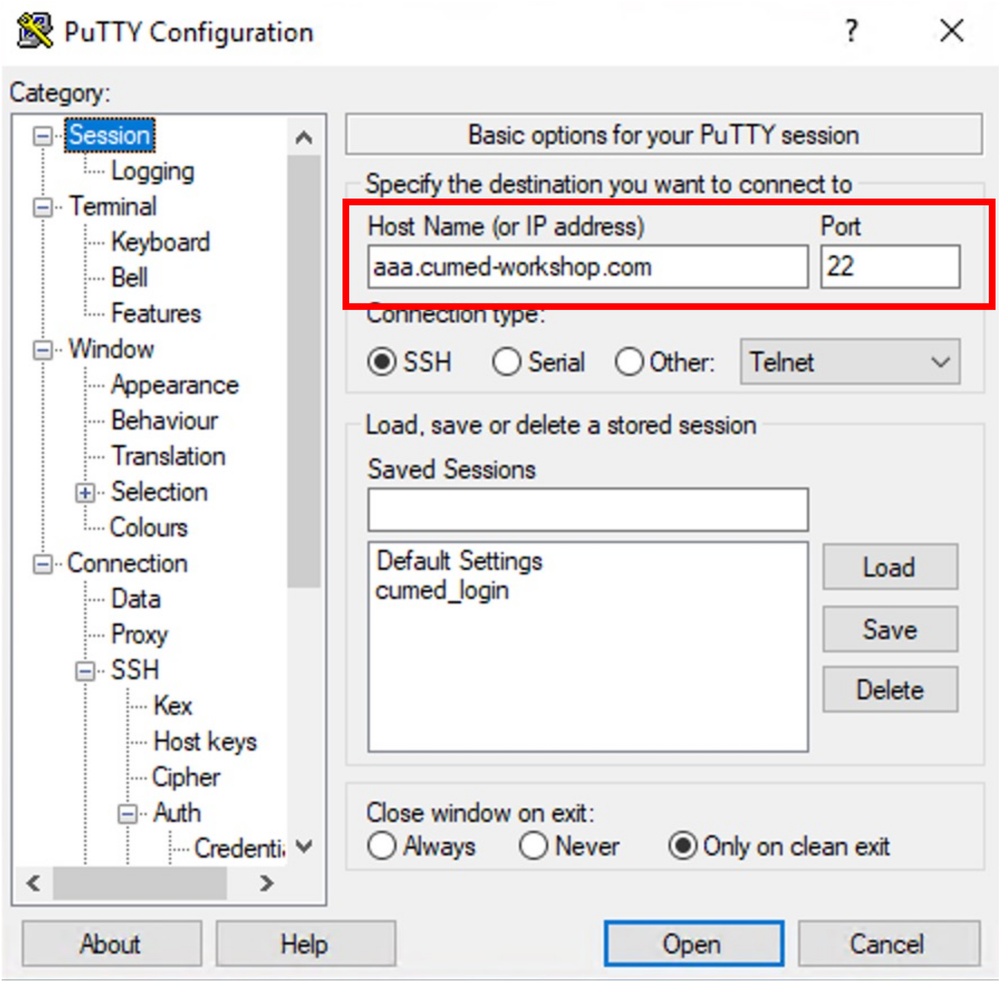
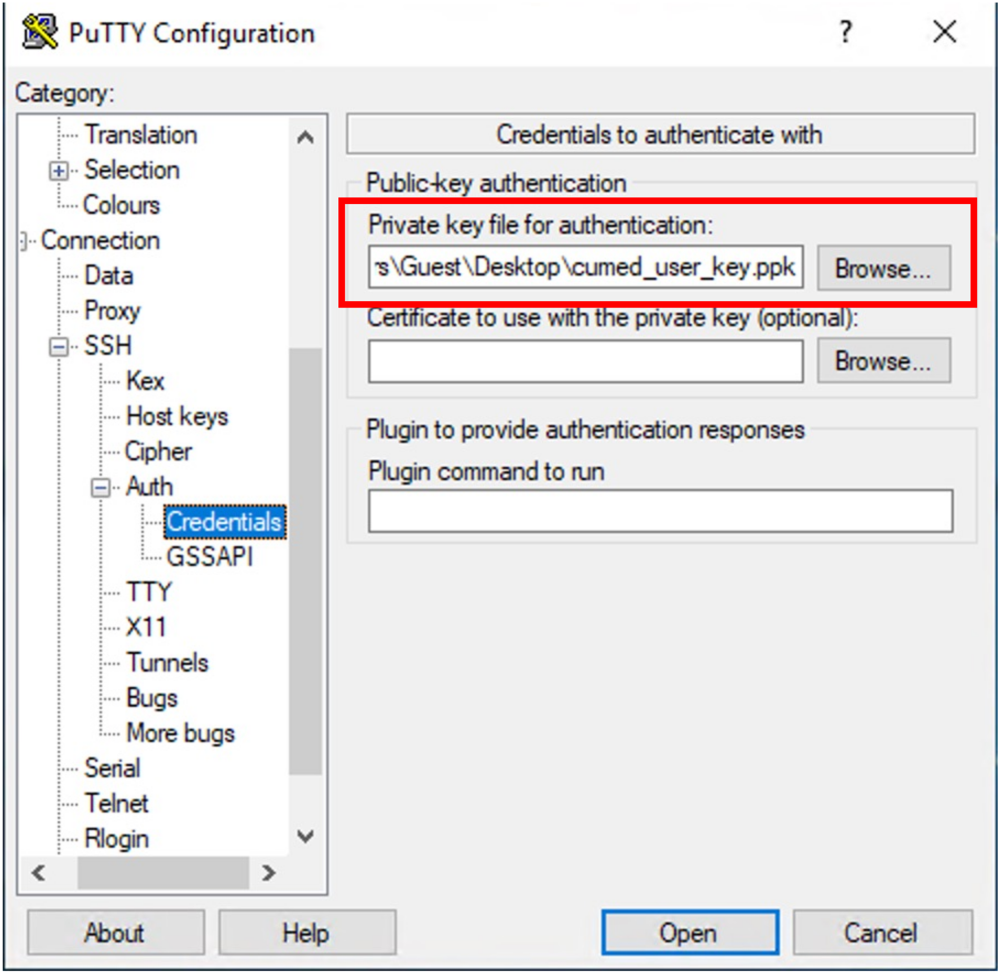
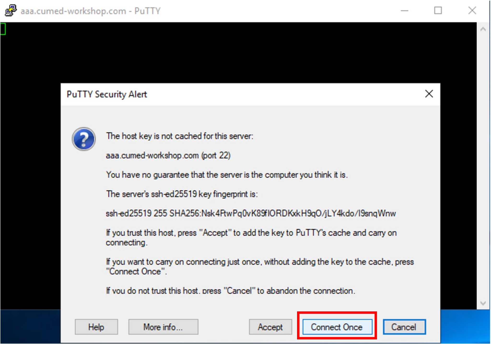
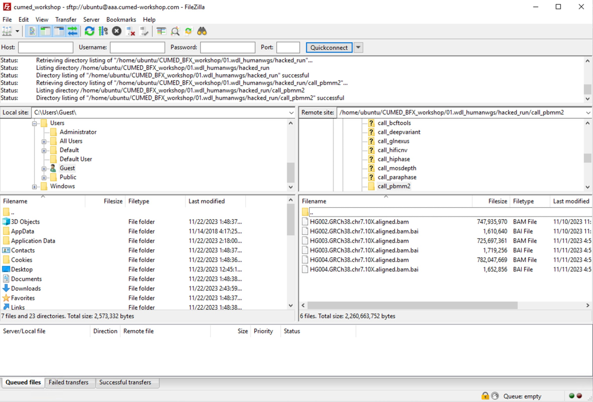

- [Download AWS EC2 private key](#download-aws-ec2-private-key)
- [Access workshop EC2 server](#access-workshop-ec2-server)
  - [0. Download Putty](#0-download-putty)
  - [1. Connecting to EC2 workshop server using Putty](#1-connecting-to-ec2-workshop-server-using-putty)
  - [Integrative Genomics Viewer (IGV)](#integrative-genomics-viewer-igv)
  - [FileZilla client](#filezilla-client)

## Download AWS EC2 private key

Please use [cumed_user_key.ppk](https://github.com/liu-xingliang/cumed_workshop/blob/main/00.prerequisites/keys/cumed_user_key.ppk) uploaded to workshop github repository (click the link and download file using top-right corner button indicated below in red box).

## Access workshop EC2 server

### 0. Download Putty

Download: [putty](https://the.earth.li/~sgtatham/putty/latest/w64/putty.exe) to your desktop and open it.

### 1. Connecting to EC2 workshop server using Putty

1. Specify host name: server_XXX.cumed-workshop.com.

2. Left "Category" panel: "Connection" -> "SSH" -> "Auth" -> "Credentials"

3. Specify login user name.

4. Click "open" to connect (Please choose "connect once" in the subsequent window, so putty will not save current host keys, which will cause some problem in current workshop AWS settings: dynamic IP for the EC2 instance).

### Integrative Genomics Viewer (IGV)

Download [IGV](https://data.broadinstitute.org/igv/projects/downloads/2.16/IGV_Win_2.16.2-WithJava-installer.exe). The installation needs admin access. If you don't have admin access, try web version: https://igv.org/app/ with limited functions.

### FileZilla client

Download [win64 installer](https://filezilla-project.org/download.php?platform=win64) and install it in  non-Administrator mode:

1. Initiate the installation.

2. Admin access is not required, please select "No".

3. Only for "me".

4. Specify a folder current non-Admin user has access to (e.g., Desktop).

5. Setup a "New Site" (e.g., "cumed_workshop"):

* Use "SFTP" protocal.
* Specify host name.
* Logon type: "Key file".
* User: "ubuntu"
* Select .ppk key file we used for Putty ssh session.

6. Please uncheck the box for NOT saving host key, as it might cause some problem in current workshop AWS settings (dynamic IP for the EC2 instance).

7. Direct to the target directory on the right panel and download (drag-and-drop is supported) selected files.

