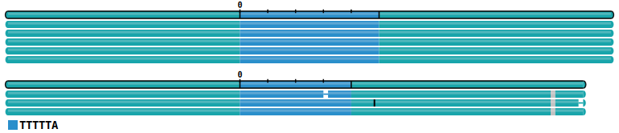

### Learning Objectives:

* Understand workflow of PacBio WDL WGS Variant Pipeline
* Understand key steps and main outputs of the pipeline 
* Understand how to prepare input (JSON) file and miniwdl configuration files for running the pipeline using Slurm job management system (JMS) on a high-performing computer (HPC)


- [Workflow of PacBio WDL WGS Variant Analysis Pipeline](#workflow-of-pacbio-wdl-wgs-variant-analysis-pipeline)
- [Demo dataset](#demo-dataset)
	- [Downsampling](#downsampling)
- [Pipeline execution walk-through using downsampled demo dataset](#pipeline-execution-walk-through-using-downsampled-demo-dataset)
	- [Setting up Conda computing environment](#setting-up-conda-computing-environment)
	- [Installing Singularity](#installing-singularity)
	- [Downloading reference dataset](#downloading-reference-dataset)
	- [Key pipeline steps and output](#key-pipeline-steps-and-output)
		- [Sample level analysis](#sample-level-analysis)
			- [0. Creating folder for hacked run of the pipeline](#0-creating-folder-for-hacked-run-of-the-pipeline)
			- [1. Mapping HiFi reads to reference genome (GRCh38)](#1-mapping-hifi-reads-to-reference-genome-grch38)
			- [2. Calling structural variants with `pbsv`](#2-calling-structural-variants-with-pbsv)
			- [3. Integrating all pbsv vcfs](#3-integrating-all-pbsv-vcfs)
			- [4. deepvariant](#4-deepvariant)
				- [make\_examples](#make_examples)
				- [call\_variants (CPU only)](#call_variants-cpu-only)
				- [postprocess\_variants](#postprocess_variants)
			- [5. bcftools `stats` and `roh`](#5-bcftools-stats-and-roh)
			- [6. Phasing small variants (SNPs/INDELs) and SVs using `hiphase`](#6-phasing-small-variants-snpsindels-and-svs-using-hiphase)
			- [7. Resolving highly homologous genes/paralogs with `paraphase`](#7-resolving-highly-homologous-genesparalogs-with-paraphase)
			- [8. Tandem repeats genotyper (TRGT)](#8-tandem-repeats-genotyper-trgt)
			- [9. Calculating 5mC CpG methylation probabilities](#9-calculating-5mc-cpg-methylation-probabilities)
			- [10. Getting reference genome coverage](#10-getting-reference-genome-coverage)
			- [11. Copy number variant (CNV) calling with HiFiCNV.](#11-copy-number-variant-cnv-calling-with-hificnv)
		- [Cohort analysis](#cohort-analysis)
			- [1. Small variants joint calling with `glnexus`](#1-small-variants-joint-calling-with-glnexus)
			- [2. Large-scale SVs joint-calling with `pbsv`](#2-large-scale-svs-joint-calling-with-pbsv)
			- [3. bcftools concat](#3-bcftools-concat)
			- [4. Phasing Joint variants calls with `hiphase`](#4-phasing-joint-variants-calls-with-hiphase)
		- [Tertiary analysis](#tertiary-analysis)
			- [1. write\_yaml\_ped\_phrank](#1-write_yaml_ped_phrank)
			- [2. svpack\_filter\_annotated](#2-svpack_filter_annotated)
			- [3. slivar\_svpack\_tsv](#3-slivar_svpack_tsv)
			- [4. slivar\_small\_variant](#4-slivar_small_variant)
- [Running pipeline using miniwdl and Slurm](#running-pipeline-using-miniwdl-and-slurm)
	- [Downloading the github repository for latest version of pipeline](#downloading-the-github-repository-for-latest-version-of-pipeline)
	- [Preparing input JSON file for the pipeline](#preparing-input-json-file-for-the-pipeline)
	- [Splitted call of pbsv](#splitted-call-of-pbsv)
	- [Executing pipeline using JMS (Slurm)](#executing-pipeline-using-jms-slurm)
	- [Other notes](#other-notes)
		- [Call cache](#call-cache)


## Workflow of PacBio WDL WGS Variant Analysis Pipeline

<p align="center">

</p>

PacBio WGS Variant Pipeline performs read alignment, variant calling, and phasing. Joint-calling of small variants and structural variants for cohorts and optional variant filtering and annotation is also available for HiFi human WGS.

## Demo dataset

The demo dataset contains three samples: Genome in a Bottle (GIAB) Ashkenazi trio (child: HG002, father: HG003, mother: HG004).

|sample|replicate|
|:---|:---|
|HG002-rep1|HG002 replicate 1|
|HG003-rep1|HG003 replicate 1|
|HG004-rep1|HG004 replicate 1|

### Downsampling

Original datasets are ~30X whole genome sequencing (WGS) data generated on [Revio](https://www.pacb.com/revio/). For this workshop, data was downsampled to 10X coverage on chr7 by creating a dummy uBAM set (reads aligned to chr7 with 10X coverage). 

<!--The reasons of choosing chr7 are:
1. Known copy number loss near centromere of chr7 in HG002.
2. Known large-scale tandem repeats in chr7:

```bash
curl -O https://hgdownload.cse.ucsc.edu/goldenpath/hg38/bigZips/hg38.trf.bed.gz
zcat hg38.trf.bed.gz | awk -F"\t" 'BEGIN{OFS="\t"}$1=="chr7"{print $1,$2,$3,$3-$2}' | less | sort -k4,4nr | head
# chr7	142041861	142046162	4301
# chr7	132561274	132564422	3148
# chr7	65226165	65229199	3034
# chr7	65226167	65229198	3031
# chr7	65226165	65229189	3024
# chr7	65144218	65146803	2585
# chr7	65650865	65653442	2577
# chr7	65549210	65551758	2548
# chr7	65503500	65505966	2466
# chr7	65503513	65505975	2462
```

PacBio WGS Analysis Pipeline can detect them.
-->

```bash
# download full HiFi bam files:
curl https://downloads.pacbcloud.com/public/revio/2022Q4/HG002-rep1/m84011_220902_175841_s1.hifi_reads.bam -o HG002-rep1.bam
curl https://downloads.pacbcloud.com/public/revio/2022Q4/HG003-rep1/m84010_220919_235306_s2.hifi_reads.bam -o HG003-rep1.bam
curl https://downloads.pacbcloud.com/public/revio/2022Q4/HG004-rep1/m84010_220919_232145_s1.hifi_reads.bam -o HG004-rep1.bam

# download full HiFi alignment to GRCh38
curl https://downloads.pacbcloud.com/public/revio/2022Q4/HG002-rep1/analysis/HG002.m84011_220902_175841_s1.GRCh38.bam -o HG002-rep1.GRCh38.aligned.bam
curl https://downloads.pacbcloud.com/public/revio/2022Q4/HG002-rep1/analysis/HG002.m84011_220902_175841_s1.GRCh38.bam.bai -o HG002-rep1.GRCh38.aligned.bam.bai

curl https://downloads.pacbcloud.com/public/revio/2022Q4/HG003-rep1/analysis/HG003.m84010_220919_235306_s2.GRCh38.bam -o HG003-rep1.GRCh38.aligned.bam
curl https://downloads.pacbcloud.com/public/revio/2022Q4/HG003-rep1/analysis/HG003.m84010_220919_235306_s2.GRCh38.bam.bai -o HG003-rep1.GRCh38.aligned.bam.bai

curl https://downloads.pacbcloud.com/public/revio/2022Q4/HG004-rep1/analysis/HG004.m84010_220919_232145_s1.GRCh38.bam -o HG004-rep1.GRCh38.aligned.bam
curl https://downloads.pacbcloud.com/public/revio/2022Q4/HG004-rep1/analysis/HG004.m84010_220919_232145_s1.GRCh38.bam.bai -o HG004-rep1.GRCh38.aligned.bam.bai

# down-sample dataset using bamsieve coming with SMRT Link

# $SMRT_ROOT is the SMRT Link installation dir 
bamsieve=$SMRT_ROOT/smrtcmds/bin/bamsieve
pbindex=$SMRT_ROOT/smrtcmds/bin/pbindex

# create dummy uBAM (reads aligned to chr7 with 10X coverage) for workshop demo
for bam in HG002-rep1.GRCh38.aligned.bam HG003-rep1.GRCh38.aligned.bam HG004-rep1.GRCh38.aligned.bam; do
    echo ${bam%.GRCh38.aligned.bam} ...

    samtools view -h -b -@8 -o ${bam%.bam}.chr7.bam $bam "chr7"
    $pbindex -j 8 ${bam%.bam}.chr7.bam

    # --genome-size 159345973 is length of chr7
    $bamsieve -s 1234 --overall-coverage 10 --genome-size 159345973 ${bam%.bam}.chr7.bam ${bam%.bam}.chr7.10X.bam

    mosdepth --no-per-base --fast-mode --chrom chr7 -t 8 ${bam%.bam}.chr7.10X.mosdepth_out ${bam%.bam}.chr7.10X.bam

    # fetched downsampled ZMWs from unmapped HiFi bam 
    # PacBio BAM index file (.pbi) and samtools BAM index (.bai) were automatically generated by bamsieve 
    $bamsieve --include ${bam%.bam}.chr7.10X.bam ${bam%.GRCh38.aligned.bam}.bam ${bam%.GRCh38.aligned.bam}.chr7.10X.bam
done
```

The downsampled HiFi bams have already been put under your home directory `~/CUMED_BFX_workshop/01.wdl_humanwgs/data`. Based on `mosdepth` summative output, overall coverage of chr7 is 10:

```bash
for f in *.GRCh38.aligned.chr7.10X.mosdepth_out.mosdepth.summary.txt; do
  echo $f
  cat $f
done

# HG002-rep1.GRCh38.aligned.chr7.10X.mosdepth_out.mosdepth.summary.txt
# chrom	length	bases	mean	min	max
# chr7	159345973	1593502441	10.00	0	193
# total	159345973	1593502441	10.00	0	193
# HG003-rep1.GRCh38.aligned.chr7.10X.mosdepth_out.mosdepth.summary.txt
# chrom	length	bases	mean	min	max
# chr7	159345973	1593766805	10.00	0	149
# total	159345973	1593766805	10.00	0	149
# HG004-rep1.GRCh38.aligned.chr7.10X.mosdepth_out.mosdepth.summary.txt
# chrom	length	bases	mean	min	max
# chr7	159345973	1592972695	10.00	0	135
# total	159345973	1592972695	10.00	0	135
```

The whole dataset can be downloaded from PacBio public [DATASETS](https://www.pacb.com/connect/datasets/).

<!--

> _[Revio system](https://www.pacb.com/revio/) is the most cutting-edge PacBio HiFi sequencing platform:_
>
> - _**15× increase in HiFi read throughput** With a high-density, 25 million ZMW SMRT Cell, up to 4 SMRT Cells in parallel, and 24-hour run times3, the Revio system delivers 360 Gb2,5 of HiFi reads per day, equivalent to 1,300 human whole genomes4 per year._
> 
> - _**The $1,000 complete, phased genome** HiFi sequencing provides small variants, structural variants, repeat expansions, methylation, and haplotype phasing from a single library and sequencing run.​_
> 
> - _**50% fewer consumables and a vastly simplified experience**_ Operating the Revio system is simple, thanks to a combined reagent and sample plate, rapid run setup, flexibility to queue runs while sequencing is in progress, and no external nitrogen supply._
> 
> - _**Google Health DeepConsensus on board**_ Advanced algorithms on the Revio system deliver exceptional read accuracy plus methylation calling in every run. Its optimized file formats reduce data storage needs through quality value binning and smart read ordering._ 

-->


## Pipeline execution walk-through using downsampled demo dataset

PacBio WGS Variant Pipeline is created using [Workflow Description Language (WDL)](https://github.com/openwdl/wdl#workflow-description-language-wdl). WDL is a workflow language which is not executable. Compliant [executions engines](https://github.com/openwdl/wdl#execution-engines) supporting WDL are required. The WDL-based PacBio WGS Variant Pipeline are supported by two popular engines: [miniwdl and Cromwell](https://github.com/PacificBiosciences/HiFi-human-WGS-WDL#configuring-a-workflow-engine).

In this workshop, `miniwdl` will be used for workflow execution due to its perfect usability.

### Setting up Conda computing environment

[Conda](https://docs.conda.io/en/latest/) is a package management system and environment management system. Conda is very popular in R/Python-based analysis. It is usually used to build reproducible and version-specific computing environemnt. With conda, users can create their own computing environments and install required packages with specific versions. Created environments will be saved and reloaded in the futher for reproducible analysis. Also different versions of same package can be installed in different environments. Users could switch between different environments to use specific version.

More importantly, conda is backed by a rich collection of pre-compiled packages and libraries, making it easier for users to set up and manage their development environments. [Anaconda](https://www.anaconda.com/) and its slim editions: [Miniconda](https://docs.conda.io/projects/miniconda/en/latest/) / [Miniforge](https://github.com/conda-forge/miniforge) are popular platforms providing pre-compiled packages and libraries. Miniforge comes from community efforts, hence open-source. Though company driven, Anaconda/Miniconda also provides public repository for community uses. Community users should not have problems using any one of the three for their analysis.

Lastly, we have [Mamba](https://github.com/mamba-org/mamba): a package manager designed to work with Conda environments, offering significant speed improvements. Mamba can be used with either Anaconda or Miniforge installations, enhancing the efficiency of managing software dependencies in data science and scientific computing projects. 

In this workshop, all packages required were pre-installed using Miniforge + Mamba

```bash
conda -V
# conda 23.9.0
# conda environment was created:
# conda create -n cumed_workshop

# load conda environment for this workshop (used by 01.wdl_humanwgs and 02.pbcromwell_isoseq sessions
mamba activate cumed_workshop
mamba install -c bioconda -c conda-forge \
miniwdl=1.11.0 \
miniwdl-slurm=0.2.0 \
git=2.42.0 \
bedtools=2.31.0 \
samtools=1.18 \
mosdepth=0.3.5

# usually don't need, but if you have problem accessing the installed binaries, try below:
# export PATH=~/miniforge3/envs/cumed_workshop/bin/:$PATH
```

### Installing Singularity

In this workshop, we will use [Singularity](https://docs.sylabs.io/guides/2.6/user-guide/introduction.html) for pre-built docker images in each step of the pipeline. Singularity has already been installed on the server using following scripts and **all required docker images have already been pulled down to workshop EC2 servers**.

```bash
#!/bin/bash -i

# Ensure repositories are up-to-date
sudo apt-get update
# Install debian packages for dependencies
# Simply press Enter (OK) when prompted
sudo apt-get install -y \
   build-essential \
   libseccomp-dev \
   libglib2.0-dev \
   pkg-config \
   squashfs-tools \
   cryptsetup \
   runc

# Install GO language
export VERSION=1.21.0 OS=linux ARCH=amd64 && \
wget https://dl.google.com/go/go$VERSION.$OS-$ARCH.tar.gz && \
sudo tar -C /usr/local -xzvf go$VERSION.$OS-$ARCH.tar.gz && \
rm go$VERSION.$OS-$ARCH.tar.gz

echo 'export GOPATH=${HOME}/go' >> ~/.bashrc && \
echo 'export PATH=/usr/local/go/bin:${PATH}:${GOPATH}/bin' >> ~/.bashrc && \
source ~/.bashrc

export VERSION=3.11.4
mkdir -p $GOPATH/src/github.com/sylabs
cd $GOPATH/src/github.com/sylabs
wget https://github.com/sylabs/singularity/releases/download/v${VERSION}/singularity-ce-${VERSION}.tar.gz
tar -xzf singularity-ce-${VERSION}.tar.gz

cd singularity-ce-${VERSION}
./mconfig && \
make -C ./builddir && \
sudo make -C ./builddir install
```

### Downloading reference dataset

There are resource files needed by some steps of the pipeline, e.g., HiFi reads alignment, variants annotation, etc. The tarball has already been downloaded and extracted to your home folder under `~/CUMED_BFX_workshop/01.wdl_humanwgs/dataset`.

```bash
wget https://zenodo.org/records/8415406/files/wdl-humanwgs.v1.0.2.resource.tgz
tar -xzf wdl-humanwgs.v1.0.2.resource.tgz && mv static_resources dataset

tree dataset/

dataset/
├── genes
│   ├── buildGenes
│   ├── ensembl.chrom.tsv
│   ├── ensembl.hgncSymbol.tsv
│   ├── mart_export.txt
│   ├── ncbiGene.ensembl.tsv
│   └── README
├── GRCh38
│   ├── annotation
│   │   ├── GRCh38.oddRegions.bed.gz
│   │   ├── GRCh38.oddRegions.bed.gz.tbi
│   │   ├── GRCh38.repeats.bed.gz
│   │   ├── GRCh38.repeats.bed.gz.tbi
│   │   ├── GRCh38.segdups.bed.gz
│   │   ├── GRCh38.segdups.bed.gz.tbi
│   │   └── README
│   ├── ensembl.GRCh38.101.reformatted.gff3.gz
│   ├── hificnv
│   │   ├── cnv.excluded_regions.common_50.hg38.bed.gz
│   │   ├── cnv.excluded_regions.common_50.hg38.bed.gz.tbi
│   │   ├── expected_cn.hg38.XX.bed
│   │   ├── expected_cn.hg38.XY.bed
│   │   └── README
│   ├── human_GRCh38_no_alt_analysis_set.chr_lengths.txt
│   ├── human_GRCh38_no_alt_analysis_set.dict
│   ├── human_GRCh38_no_alt_analysis_set.fasta
│   ├── human_GRCh38_no_alt_analysis_set.fasta.fai
│   ├── human_GRCh38_no_alt_analysis_set.pbsv_splits.json
│   ├── human_GRCh38_no_alt_analysis_set.ploidy.txt
│   ├── human_GRCh38_no_alt_analysis_set.trf.bed
│   ├── pharmcat
│   │   ├── pharmcat_positions_README.txt
│   │   ├── pharmcat_positions.vcf.bgz
│   │   └── pharmcat_positions.vcf.bgz.csi
│   ├── README
│   ├── slivar_gnotate
│   │   ├── add_nhomalt.py
│   │   ├── buildChrX
│   │   ├── buildGnomad
│   │   ├── gnomad.hg38.v3.custom.v1.zip
│   │   ├── hprc.deepvariant.glnexus.hg38.v1.zip
│   │   ├── hprc_samples.txt
│   │   ├── hprc_sex.txt
│   │   └── README
│   ├── sv_pop_vcfs
│   │   ├── EEE_SV-Pop_1.ALL.sites.20181204.vcf.gz
│   │   ├── EEE_SV-Pop_1.ALL.sites.20181204.vcf.gz.tbi
│   │   ├── hprc.GRCh38.pbsv.vcf.gz
│   │   ├── hprc.GRCh38.pbsv.vcf.gz.tbi
│   │   ├── hprc_samples.txt
│   │   ├── nstd166.GRCh38.variant_call.vcf.gz
│   │   ├── nstd166.GRCh38.variant_call.vcf.gz.tbi
│   │   ├── ont_sv_high_confidence_SVs.sorted.vcf.gz
│   │   ├── ont_sv_high_confidence_SVs.sorted.vcf.gz.tbi
│   │   └── README
│   └── trgt
│       ├── human_GRCh38_no_alt_analysis_set.trgt.v0.3.4.bed
│       └── README
├── hpo
│   ├── buildHpo
│   ├── ensembl.hpoPhenotype.tsv
│   ├── ensembl.inheritance.tsv
│   ├── genes_to_phenotype.txt
│   ├── hpoDagModifications.add.txt
│   ├── hpoDagModifications.remove.txt
│   ├── hpoDag.txt
│   ├── hpoTerms.txt
│   └── README
└── slivar
    ├── clinvar_gene_desc.20221214T183140.txt
    ├── lof_lookup.v2.1.1.txt
    ├── README
    └── slivar-functions.v0.2.8.js

10 directories, 63 files
```

### Key pipeline steps and output

#### Sample level analysis

Per-sample analysis is applied to each sample in the cohort, including quality-control, HiFi reads alignment to the reference genome, full-spectrum variants calling and phasing (SNV/INDEL/SV).

To enhance reproducibility, each step of the analysis was performed using [docker images](https://github.com/PacificBiosciences/wdl-dockerfiles), which are hosted in PacBio's [quay.io](https://quay.io/organization/pacbio). Docker images and corresponding tool versions for current repo commit used for this workshop can be found [here](https://github.com/PacificBiosciences/HiFi-human-WGS-WDL/tree/b6a2cd27bc5cb762afd1a9891d622cdf29fb5f39#tool-versions-and-docker-images).

To help BFX attendees understand better what the pipeline does for each step, i,e., which tool/command is invoked. We will do "hacked run": hack into the pipeline, run each analysis step using corresponding command lines with Singularity shell and pre-built docker image.

##### 0. Creating folder for hacked run of the pipeline

```bash
mkdir -p ~/CUMED_BFX_workshop/01.wdl_humanwgs/hacked_run
```

##### 1. Mapping HiFi reads to reference genome (GRCh38) 

This step takes around 10 mins to finish. Impatient attendees don't need to run this step by themselves, aligned bam is provided: `~/CUMED_BFX_workshop/01.wdl_humanwgs/hacked_run/HG002.GRCh38.chr7.10X.aligned.bam` for next step.

```bash
# singularity pull pbmm2.sif docker://quay.io/pacbio/pbmm2@sha256:1013aa0fd5fb42c607d78bfe3ec3d19e7781ad3aa337bf84d144c61ed7d51fa1

# create Singularity shell using pulled docker image
singularity shell -B ~/CUMED_BFX_workshop/01.wdl_humanwgs/dataset:/mnt/dataset \
-B ~/CUMED_BFX_workshop/01.wdl_humanwgs/data:/mnt/data \
-B ${PWD}:/mnt/out pbmm2.sif

which pbmm2
# /usr/local/bin/pbmm2

pbmm2 --version
# pbmm2 1.10.0
# 
# Using:
#   pbmm2    : 1.10.0 (commit v1.10.0)
#   pbbam    : 2.3.0 (commit v2.3.0)
#   pbcopper : 2.2.0 (commit v2.2.0)
#   boost    : 1.77
#   htslib   : 1.15
#   minimap2 : 2.15
#   zlib     : 1.2.11

# pbmm2 index was pre-built for fast run of pbmm2
# pbmm2 index human_GRCh38_no_alt_analysis_set.fasta human_GRCh38_no_alt_analysis_set.fasta.mmi

mkdir -p call_pbmm2

time pbmm2 align \
	--num-threads 4 \
	--sort-memory 4G \
	--preset HIFI \
	--sample HG002 \
	--log-level INFO \
	--sort \
	--unmapped \
	/mnt/dataset/GRCh38/human_GRCh38_no_alt_analysis_set.fasta.mmi \
	/mnt/data/HG002-rep1.chr7.10X.bam \
	/mnt/out/call_pbmm2/HG002.GRCh38.chr7.10X.aligned.bam

# real	9m54.419s
# user	29m40.374s
# sys	0m13.058s

# exit Singularity shell
exit
```

Though down-sampled input HiFi reads are derived from reads mapping to chr7 in a full-set (30X) pbmm2 alignment to GRCh38 using same version of pbmm2: v1.10.0 (commit v1.10.0).

Howerver, when we mapped down-sampled HiFi subset to GRCh38, still got ~3% of alignments mapped to other chromosomes, but most of them are supplemental alignments (`samtools view -f 2048`) or low quality alignments (`samtools view -f 0`), could be ignored. Only 356 alignments (`samtools view -f 16`) are primary. Out of them 177 are actually derived from chimeric alignments of long HiFi reads with other parts mapping to chr7 ("SA:Z:chr7").

`SA:Z:(rname,pos,strand,CIGAR,mapQ,NM;)+`:
>Other canonical alignments in a chimeric alignment, formatted as a semicolon-delimited list. Each element in the list represents a part of the chimeric alignment. Conventionally, at a supplementary line, the first element points to the primary line. Strand is either ‘+’ or ‘-’, indicating forward/reverse strand, corresponding to FLAG bit 0x10. Pos is a 1-based
coordinate.

For remaining small number of non-chr7 alignments, reasons are unknown, but might be because of challenging genome regions (e.g., highly repeative). As this dataset will be only used for demo purpose of how to run the pipeline and does not reflect the real use cases, therefore attendees could ignore those non-chr7 alignments for now.

<!--

```bash
Singularity> samtools view /mnt/out/call_pbmm2/HG002.GRCh38.chr7.10X.aligned.bam | awk -F"\t" '$3!="chr7" && $2==16' | grep "SA:Z:chr7" | wc -l
177
Singularity> samtools view /mnt/out/call_pbmm2/HG002.GRCh38.chr7.10X.aligned.bam | awk -F"\t" '$3!="chr7" && $2==16' | wc -l
365
Singularity> samtools view /mnt/out/call_pbmm2/HG002.GRCh38.chr7.10X.aligned.bam | awk -F"\t" '$3!="chr7" && $2==16' | grep "SA:Z:chr[0-9][0-9]*" -o | sort  |uniq -c
      6 SA:Z:chr1
      4 SA:Z:chr10
      9 SA:Z:chr11
      3 SA:Z:chr12
      1 SA:Z:chr13
      2 SA:Z:chr14
      1 SA:Z:chr15
     14 SA:Z:chr16
     12 SA:Z:chr17
     10 SA:Z:chr19
     10 SA:Z:chr2
     12 SA:Z:chr20
      4 SA:Z:chr21
     10 SA:Z:chr22
      8 SA:Z:chr3
      3 SA:Z:chr4
     10 SA:Z:chr5
      7 SA:Z:chr6
    177 SA:Z:chr7
      2 SA:Z:chr8
      2 SA:Z:chr9
```

```bash
Singularity> samtools view /mnt/out/call_pbmm2/HG002.GRCh38.chr7.10X.aligned.bam | cut -f3 | sort | uniq -c | sed -r 's/^  *//;s/ /\t/' | sort -k1,1nr 
104864  chr7
189     chr2
177     chr3
154     chr6
153     chr16
147     chr1
136     chr19
131     chr4
126     chr5
109     chr11
94      chr12
92      chr20
86      chr21
84      chr8
82      chr10
80      chr13
80      chr22
75      chr17
71      chrX
56      chr9
46      chr14
44      chr15
43      chrY
31      chrUn_KI270442v1
29      chr17_KI270729v1_random
27      chr18
26      chrUn_KI270757v1
16      chr22_KI270736v1_random
12      chr16_KI270728v1_random
10      chr1_KI270709v1_random
6       chr22_KI270734v1_random
6       chrUn_KI270467v1
5       chr4_GL000008v2_random
5       chrUn_KI270584v1
4       chr22_KI270735v1_random
4       chr22_KI270737v1_random
4       chr22_KI270738v1_random
3       chr14_KI270725v1_random
3       chr17_KI270730v1_random
3       chrUn_KI270438v1
2       chr14_GL000009v2_random
2       chrUn_GL000220v1
2       chrUn_KI270333v1
2       chrUn_KI270591v1
1       chr14_GL000194v1_random
1       chr22_KI270739v1_random
1       chr2_KI270716v1_random
1       chr9_KI270717v1_random
1       chrUn_GL000216v2
1       chrUn_KI270435v1
1       chrUn_KI270510v1
1       chrUn_KI270512v1
1       chrUn_KI270519v1
1       chrUn_KI270521v1
1       chrUn_KI270522v1
1       chrUn_KI270528v1
1       chrUn_KI270579v1
1       chrUn_KI270746v1
1       chrUn_KI270756v1
1       chrY_KI270740v1_random


Singularity> samtools view /mnt/out/call_pbmm2/HG002.GRCh38.chr7.10X.aligned.bam | awk -F"\t" '$3!="chr7"' | cut -f2 | sort | uniq -c
    414 0
    365 16
    869 2048
    825 2064

Singularity> samtools view /mnt/out/call_pbmm2/HG002.GRCh38.chr7.10X.aligned.bam | awk -F"\t" '$3!="chr7" && $2==16' | cut -f3 | sort | uniq -c 
     21 chr1
     10 chr10
     18 chr11
      7 chr12
     13 chr13
     10 chr14
      1 chr14_KI270725v1_random
      8 chr15
     19 chr16
      5 chr16_KI270728v1_random
     15 chr17
      3 chr17_KI270729v1_random
      3 chr18
     16 chr19
      4 chr1_KI270709v1_random
     30 chr2
     15 chr20
     17 chr21
     16 chr22
      1 chr22_KI270735v1_random
      1 chr22_KI270739v1_random
     28 chr3
     21 chr4
     21 chr5
     16 chr6
      7 chr8
     12 chr9
      8 chrUn_KI270442v1
      1 chrUn_KI270584v1
      1 chrUn_KI270746v1
      9 chrUn_KI270757v1
      3 chrX
      4 chrY
      1 chrY_KI270740v1_random
```
-->

<!--
There are alignment QC scripts included in docker image, attendees could have a try.

```bash
singularity shell -B ~/CUMED_BFX_workshop/01.wdl_humanwgs/dataset:/mnt/dataset \
-B ~/CUMED_BFX_workshop/01.wdl_humanwgs/data:/mnt/data \
-B ${PWD}:/mnt/out pbmm2.sif

# movie stats
time extract_read_length_and_qual.py \
	/mnt/data/HG002-rep1.chr7.10X.bam \
> /mnt/out/call_pbmm2/HG002.10X.GRCh38.chr7.read_length_and_quality.tsv
# real	0m12.980s
# user	0m12.289s
# sys	0m0.332s

time awk '{{ b=int($2/1000); b=(b>39?39:b); print 1000*b "\t" $2; }}' \
	/mnt/out/call_pbmm2/HG002.10X.GRCh38.chr7.read_length_and_quality.tsv \
	| sort -k1,1g \
	| datamash -g 1 count 1 sum 2 \
	| awk 'BEGIN {{ for(i=0;i<=39;i++) {{ print 1000*i"\t0\t0"; }} }} {{ print; }}' \
	| sort -k1,1g \
	| datamash -g 1 sum 2 sum 3 \
> /mnt/out/call_pbmm2/HG002.10X.GRCh38.chr7.read_length_summary.tsv
# real	0m0.265s
# user	0m0.215s
# sys	0m0.021s

time awk '{{ print ($3>50?50:$3) "\t" $2; }}' \
		/mnt/out/call_pbmm2/HG002.10X.GRCh38.chr7.read_length_and_quality.tsv \
	| sort -k1,1g \
	| datamash -g 1 count 1 sum 2 \
	| awk 'BEGIN {{ for(i=0;i<=60;i++) {{ print i"\t0\t0"; }} }} {{ print; }}' \
	| sort -k1,1g \
	| datamash -g 1 sum 2 sum 3 \
> /mnt/out/call_pbmm2/HG002.10X.GRCh38.chr7.read_quality_summary.tsv
# real	0m0.179s
# user	0m0.188s
# sys	0m0.007s
```
-->

##### 2. Calling structural variants with `pbsv`

Pbsv uses two steps to call SVs in VCF format:
1. `pbsv discover`: find SV signatures in read alignments (BAM to SVSIG)
2. `pbsv call`: call SVs from signatures and assign genotypes (SVSIG to VCF)

It is highly recommended to provide one tandem repeat annotation .bed file (e.g., `dataset/GRCh38/human_GRCh38_no_alt_analysis_set.trf.bed`) of your reference to pbsv discover via --tandem-repeats. This increases sensitivity and recall.

```bash
# singularity pull pbsv.sif docker://quay.io/pacbio/pbsv@sha256:d78ee6deb92949bdfde98d3e48dab1d871c177d48d8c87c73d12c45bdda43446

singularity shell -B ~/CUMED_BFX_workshop/01.wdl_humanwgs/dataset:/mnt/dataset \
-B ~/CUMED_BFX_workshop/01.wdl_humanwgs/data:/mnt/data \
-B ${PWD}:/mnt/out pbsv.sif

pbsv --version
# pbsv 2.9.0 (commit v2.9.0-2-gce1559a)

mkdir -p /mnt/out/call_pbsv
time pbsv discover \
	--log-level INFO \
	--hifi \
	--tandem-repeats /mnt/dataset/GRCh38/human_GRCh38_no_alt_analysis_set.trf.bed \
	/mnt/out/call_pbmm2/HG002.GRCh38.chr7.10X.aligned.bam \
	/mnt/out/call_pbsv/HG002.GRCh38.chr7.10X.aligned.svsig.gz

# real	0m13.472s
# user	0m14.063s
# sys	0m0.241s

# pbsv call - Call structural variants from SV signatures and assign genotypes (SVSIG to VCF).

mkdir -p /mnt/out/call_pbsv
time pbsv call \
	--hifi \
	--min-sv-length 20 \
	--log-level INFO \
	--num-threads 4 \
	/mnt/dataset/GRCh38/human_GRCh38_no_alt_analysis_set.fasta \
	/mnt/out/call_pbsv/HG002.GRCh38.chr7.10X.aligned.svsig.gz \
	/mnt/out/call_pbsv/HG002.GRCh38.chr7.10X.pbsv.vcf

# real	5m54.181s
# user	12m20.020s
# sys	1m6.002s

bgzip /mnt/out/call_pbsv/HG002.GRCh38.chr7.10X.pbsv.vcf
tabix -p vcf /mnt/out/call_pbsv/HG002.GRCh38.chr7.10X.pbsv.vcf.gz

# exit Singularity shell
exit
```

Attendees could take a quick look at SV signatures and SV vcf in Bash shell:

```bash
# z* command is for gz format
# less -S displays each raw in one line (key shortcuts: "f" for scrolling down and "b" for scrolling up, "left" and "right" for moving left and right)
zless -S ~/CUMED_BFX_workshop/01.wdl_humanwgs/hacked_run/call_pbsv/HG002.GRCh38.chr7.10X.aligned.svsig.gz
zless -S ~/CUMED_BFX_workshop/01.wdl_humanwgs/hacked_run/call_pbsv/HG002.GRCh38.chr7.10X.pbsv.vcf.gz
```

And check specific SV using [IGV](https://igv.org/doc/desktop/#DownloadPage/). IGV has already been downloaded to your server, to lanuch IGV on the server:
1. Double click "Xfce Terminal" on Desktop.
2. In terminal, run `~/Desktop/IGV_Linux_2.16.2/igv.sh`.

For example, we found there is a 21bp deletion in pbsv output vcf file:

<p align="left">

</p>

To visualize this deletion, we can download pbmm2 alignment: `/home/ubuntu/CUMED_BFX_workshop/01.wdl_humanwgs/hacked_run/call_pbmm2/HG002.GRCh38.chr7.10X.aligned.bam` (including .bai index). After loading alignment bam into IGV and zooming in to the SV loci, we could spot the deletion:

<p align="left">

</p>

##### 3. Integrating all pbsv vcfs

As we only have one vcf for chr7, therefore skip this step.

```bash
# skip
# # singularity pull bcftools.sif docker://quay.io/pacbio/bcftools@sha256:36d91d5710397b6d836ff87dd2a924cd02fdf2ea73607f303a8544fbac2e691f
# 
# singularity shell -B ~/CUMED_BFX_workshop/01.wdl_humanwgs/dataset:/mnt/dataset \
# -B ~/CUMED_BFX_workshop/01.wdl_humanwgs/data:/mnt/data \
# -B ${PWD}:/mnt/out bcftools.sif
# 
# find vcfs -name "*.vcf.gz" > vcf.list
# bcftools concat \
# 	--allow-overlaps \
# 	--threads 3 \
# 	--output-type z \
# 	--output HG002.GRCh38.pbsv.vcf.gz \
# 	--file-list vcf.list
# 
# bcftools index --tbi HG002.GRCh38.pbsv.vcf.gz
```

##### 4. deepvariant

> _DeepVariant has 3 stages: make examples, call variants, and postprocess variants. The middle stage is when the deep neural network does its classification, while the first stage prepares data for the neural network, and the last stage interprets the classifications output by the neural network as variant calls_.

For more details, please refer to DV doc: [looking-through-deepvariants-eyes](https://google.github.io/deepvariant/posts/2020-02-20-looking-through-deepvariants-eyes/).

###### make_examples

`make_examples` consumes reads and the reference genome to create TensorFlow examples for evaluation with the deep learning models.

`make_examples` is a **single-threaded program** using 1-2 GB of RAM. The execution time for the demo dataset is ~30 mins (even with `--regions "chr7"` to reduce the number of examples generated) on slim workshop servers (4 CPUs). This is long for this 1.5 hrs session, therefore two results folders: `example_tfrecords` and `nonvariant_site_tfrecords` for this step have been uploaded to demo run results folder: `~/CUMED_BFX_workshop/01.wdl_humanwgs/call_deepvariant/example_tfrecords` and  `~/CUMED_BFX_workshop/01.wdl_humanwgs/call_deepvariant/nonvariant_site_tfrecords`.

To increase the level of parallelism, `make_examples` supports sharding of its input and output via the `--task` argument with a sharded output specification. Below is the `make_examples` commands used in the pipeline (of course, the number of shards and parallel jobs for a full Human WGS dataset, e.g., 30X dataset, will be larger and the pipeline does not need singularity shell for each command):

```bash
# gcr.io/deepvariant-docker/deepvariant:1.5.0
# singularity pull deepvariant.sif docker://gcr.io/deepvariant-docker/deepvariant:1.5.0

singularity shell -B ~/CUMED_BFX_workshop/01.wdl_humanwgs/dataset:/mnt/dataset \
-B ~/CUMED_BFX_workshop/01.wdl_humanwgs/data:/mnt/data \
-B ${PWD}:/mnt/out deepvariant.sif

mkdir -p /mnt/out/call_deepvariant/example_tfrecords /mnt/out/call_deepvariant/nonvariant_site_tfrecords

# add --regions "chr7" for this demo dataset to reduce the number of TensorFlow examples generated
time seq 0 15 | parallel --jobs 4 /opt/deepvariant/bin/make_examples \
	--norealign_reads \
	--vsc_min_fraction_indels 0.12 \
	--pileup_image_width 199 \
	--track_ref_reads \
	--phase_reads \
	--regions "chr7" \
	--partition_size=2500 \
	--max_reads_per_partition=600 \
	--alt_aligned_pileup=diff_channels \
	--add_hp_channel \
	--sort_by_haplotypes \
	--parse_sam_aux_fields \
	--min_mapping_quality=1 \
	--mode calling \
	--ref /mnt/dataset/GRCh38/human_GRCh38_no_alt_analysis_set.fasta \
	--reads /mnt/out/call_pbmm2/HG002.GRCh38.chr7.10X.aligned.bam \
	--examples /mnt/out/call_deepvariant/example_tfrecords/HG002.examples.tfrecord@16.gz \
	--gvcf /mnt/out/call_deepvariant/nonvariant_site_tfrecords/HG002.gvcf.tfrecord@16.gz \
	--task {}

# real	24m40.827s
# user	97m55.869s
# sys	0m27.740s
```

###### call_variants (CPU only)

`call_variants` consumes TFRecord file(s) of tf.Examples protos created by `make_examples` and a deep learning model checkpoint and evaluates the model on each example in the input TFRecord. The output here is a TFRecord of CallVariantsOutput protos. call_variants doesn't directly support sharding its outputs, but accepts a glob or shard-pattern for its inputs.

_When using a GPU, call_variants is both faster, more efficient, and needs fewer CPUs. Based on a small number of experiments, currently **the most efficient configuration for call_variants on a GPU instance is 4-8 CPUs and 1 GPU**._
(https://github.com/google/deepvariant/blob/r1.5/docs/deepvariant-details.md#call_variants)

This step also takes a while to run given slim computing resources available on workshop demo server, so the result `call_deepvariant/HG002.GRCh38.call_variants_output.tfrecord.gz` has already been provided. 

```bash
# use default deepvariant model: /opt/models/pacbio/model.ckpt if users don't provide their own ones
time /opt/deepvariant/bin/call_variants \
	--outfile /mnt/out/call_deepvariant/HG002.GRCh38.call_variants_output.tfrecord.gz \
	--examples "/mnt/out/call_deepvariant/example_tfrecords/HG002.examples.tfrecord@16.gz" \
	--checkpoint "/opt/models/pacbio/model.ckpt"

# real	48m45.346s
# user	184m16.511s
# sys	0m26.536s
```

###### postprocess_variants

`postprocess_variants` is a single-threaded program, reads all of the output TFRecord files from call_variants, sorts them, combines multi-allelic records, and writes out a VCF file. When gVCF output is requested, **it also outputs a gVCF file which merges the VCF with the non-variant sites**.

```bash
time /opt/deepvariant/bin/postprocess_variants \
	--vcf_stats_report=false \
	--ref /mnt/dataset/GRCh38/human_GRCh38_no_alt_analysis_set.fasta \
	--infile /mnt/out/call_deepvariant/HG002.GRCh38.call_variants_output.tfrecord.gz \
	--outfile /mnt/out/call_deepvariant/HG002.GRCh38.deepvariant.vcf.gz \
	--nonvariant_site_tfrecord_path "/mnt/out/call_deepvariant/nonvariant_site_tfrecords/HG002.gvcf.tfrecord@16.gz" \
	--gvcf_outfile /mnt/out/call_deepvariant/HG002.GRCh38.deepvariant.g.vcf.gz

# real	2m3.544s
# user	2m2.133s
# sys	0m1.691s
```

Similarly, attendees could view deepvariant output VCF:

```bash
cd /home/ubuntu/CUMED_BFX_workshop/01.wdl_humanwgs/hacked_run/call_deepvariant
zless -S HG002.GRCh38.deepvariant.vcf.gz
```

And check specific variant in IGV. E.g.:

<p align="left">

</p>

<p align="left">

</p>

To understand how a candidate variant of interest was represented when it was passed into the neural network in DeepVariant. `show_examples` can print pileup images used within DeepVariant and save them as PNG image files.

```bash
# prepare VCF for targeted variant 
cd /home/ubuntu/CUMED_BFX_workshop/01.wdl_humanwgs/hacked_run/call_deepvariant
zcat HG002.GRCh38.deepvariant.vcf.gz | awk -F"\t" '/^#/ || ($1=="chr7" && $2==44935)' > chr7_44935_C_T.vcf

singularity shell -B ~/CUMED_BFX_workshop/01.wdl_humanwgs/dataset:/mnt/dataset \
-B ~/CUMED_BFX_workshop/01.wdl_humanwgs/data:/mnt/data \
-B ${PWD}:/mnt/out deepvariant.sif

mkdir -p /mnt/out/call_deepvariant/show_examples

time /opt/deepvariant/bin/show_examples \
  --examples=/mnt/out/call_deepvariant/example_tfrecords/HG002.examples.tfrecord@16.gz \
  --vcf /mnt/out/call_deepvariant/chr7_44935_C_T.vcf \
  --output=/mnt/out/call_deepvariant/show_examples/pileup

# real	6m23.365s
# user	3m49.055s
# sys	0m1.187s
```

There will be only one image outputed (for the only one variant selected): `/home/ubuntu/CUMED_BFX_workshop/01.wdl_humanwgs/hacked_run/call_deepvariant/show_examples/pileup_channels_chr7:44934_C->T.png`

<p align="left">

</p>

##### 5. bcftools `stats` and `roh`

`bcftools stats`

Parses VCF or BCF and produces stats which can be plotted using plot-vcfstats.

`bcftools roh`

HMM model for detecting runs of autozygosity (ROH).

```bash
# singularity pull bcftools.sif docker://quay.io/pacbio/bcftools@sha256:36d91d5710397b6d836ff87dd2a924cd02fdf2ea73607f303a8544fbac2e691f

singularity shell -B ~/CUMED_BFX_workshop/01.wdl_humanwgs/dataset:/mnt/dataset \
-B ~/CUMED_BFX_workshop/01.wdl_humanwgs/data:/mnt/data \
-B ${PWD}:/mnt/out bcftools.sif

mkdir -p /mnt/out/call_bcftools

time bcftools stats \
	--threads 1 \
	--apply-filters PASS --samples HG002 \
	--fasta-ref /mnt/dataset/GRCh38/human_GRCh38_no_alt_analysis_set.fasta \
	/mnt/out/call_deepvariant/HG002.GRCh38.deepvariant.vcf.gz \
> /mnt/out/call_bcftools/HG002.GRCh38.deepvariant.vcf.stats.txt

# real	0m1.035s
# user	0m1.028s
# sys	0m0.117s

time bcftools roh \
	--threads 1 \
	--AF-dflt 0.4 \
	/mnt/out/call_deepvariant/HG002.GRCh38.deepvariant.vcf.gz \
> /mnt/out/call_bcftools/HG002.GRCh38.deepvariant.bcftools_roh.out

# Number of target samples: 1
# Number of --estimate-AF samples: 0
# Number of sites in the buffer/overlap: unlimited
# Number of lines total/processed: 434734/429051
# Number of lines filtered/no AF/no alt/multiallelic/dup: 0/0/0/5620/0
# 
# real	0m0.576s
# user	0m0.650s
# sys	0m0.020s

echo -e "#chr\\tstart\\tend\\tqual" > /mnt/out/call_bcftools/HG002.GRCh38.deepvariant.roh.bed
awk -v OFS='\t' '$1=="RG" {{ print $3, $4, $5, $8 }}' \
	/mnt/out/call_bcftools/HG002.GRCh38.deepvariant.bcftools_roh.out \
>> /mnt/out/call_bcftools/HG002.GRCh38.deepvariant.roh.bed
```

`bcftools` comes with `plot-vcfstats` to view statistics generated by `bcftools stats`, which is included in the bcftools docker image:

```bash
singularity shell -B ~/CUMED_BFX_workshop/01.wdl_humanwgs/dataset:/mnt/dataset \
-B ~/CUMED_BFX_workshop/01.wdl_humanwgs/data:/mnt/data \
-B ${PWD}:/mnt/out bcftools.sif

plot-vcfstats -h
# About: Plots the output of "bcftools stats"
# Usage: plot-vcfstats [OPTIONS] -p outdir file.chk ...
# Options:
#    -m, --merge                         Merge vcfstats files to STDOUT, skip plotting.
#    -p, --prefix <dir>                  Output directory.
#    -P, --no-PDF                        Skip the PDF creation step.
#    -r, --rasterize                     Rasterize PDF images for fast rendering, the default and opposite of -v.
#    -s, --sample-names                  Use sample names for xticks rather than numeric IDs.
#    -t, --title <string>                Identify files by these titles in plots. Can be given multiple times.
#    -T, --main-title <string>           Main title for the PDF.
#    -v, --vectors                       Generate vector graphics for PDF images, the opposite of -r
#    -h, -?, --help                      This help message.

# Plot the stats
plot-vcfstats -p /mnt/out/call_bcftools /mnt/out/call_bcftools/HG002.GRCh38.deepvariant.vcf.stats.txt
```

Above command generates plotting scripts of python3, docker image does not provide python3 to do the actual plotting, therefore need to run:

```bash
# mamba create -n plot-vcfstats 
mamba activate plot-vcfstats

python3 --version
# Python 3.10.12

mamba install matplotlib pdflatex

# The final looks can be customized by editing the generated
# 'outdir/plot.py' script and re-running manually
cd /home/ubuntu/CUMED_BFX_workshop/01.wdl_humanwgs/hacked_run/call_bcftools

python3 plot.py 
```

A few meaningful plots for this single chr demo dataset:

<!--
1. tstv_by_qual.0.png

Ts/Tv (transition-to-transversion) ratio is around 2-2.10, which is expected for human across the whole genome.

<p align="left">

</p>
-->

1. indel_vaf.0.png

An overview of alternative allele%.

<p align="left">

</p>


2. depth.0.png

The peak coverage of genotypes is ~10X which is consistent to demo dataset depth.

<p align="left">

</p>


For more versatile vcf statistics visualization, attendees could try [/opt/deepvariant/bin/vcf_stats_report](https://github.com/google/deepvariant/blob/r1.5/docs/deepvariant-vcf-stats-report.md).

##### 6. Phasing small variants (SNPs/INDELs) and SVs using `hiphase`

[HiPhase](https://github.com/PacificBiosciences/HiPhase) will phase variant calls made from PacBio HiFi datasets. HiPhase can phase both small variants (SNPs/INDELs) like WhatsHap and large-scale SVs, which is difficult to handle with WhatsHap.

```bash
# singularity pull hiphase.sif  docker://quay.io/pacbio/hiphase@sha256:c09ec4d70568593098bf877475d15a4cd8e46b5173b91b07ac98c4518817341f

singularity shell -B ~/CUMED_BFX_workshop/01.wdl_humanwgs/dataset:/mnt/dataset \
-B ~/CUMED_BFX_workshop/01.wdl_humanwgs/data:/mnt/data \
-B ${PWD}:/mnt/out hiphase.sif

hiphase --version
# hiphase 0.10.2

mkdir -p /mnt/out/call_hiphase
# phase VCFs and haplotag BAM
time hiphase --threads 4 \
	--sample-name HG002 \
	--vcf /mnt/out/call_deepvariant/HG002.GRCh38.deepvariant.vcf.gz --vcf /mnt/out/call_pbsv/HG002.GRCh38.chr7.10X.pbsv.vcf.gz \
	--output-vcf /mnt/out/call_hiphase/HG002.GRCh38.deepvariant.phased.vcf.gz --output-vcf /mnt/out/call_hiphase/HG002.GRCh38.pbsv.phased.vcf.gz \
	--bam /mnt/out/call_pbmm2/HG002.GRCh38.chr7.10X.aligned.bam \
	--output-bam  /mnt/out/call_hiphase/HG002.GRCh38.chr7.10X.aligned.haplotagged.bam \
	--reference /mnt/dataset/GRCh38/human_GRCh38_no_alt_analysis_set.fasta \
	--summary-file /mnt/out/call_hiphase/HG002.GRCh38.chr7.10X.hiphase.stats.tsv \
	--blocks-file /mnt/out/call_hiphase/HG002.GRCh38.chr7.10X.hiphase.blocks.tsv \
	--haplotag-file /mnt/out/call_hiphase/HG002.GRCh38.chr7.10X.hiphase.haplotags.tsv \
	--global-realignment-cputime 300

# real	2m12.026s
# user	7m0.044s
# sys	0m10.223s

# index phased VCFs
for phased_vcf in /mnt/out/call_hiphase/HG002.GRCh38.deepvariant.phased.vcf.gz /mnt/out/call_hiphase/HG002.GRCh38.pbsv.phased.vcf.gz; do
	bcftools index --tbi --threads 4 $phased_vcf
done
```

After HiPhase, HiFi reads in the demo dataset will be phased into two haplotypes based on variants called using deepvariant and pbsv. Phased reads/alignment: `/home/ubuntu/CUMED_BFX_workshop/01.wdl_humanwgs/hacked_run/call_hiphase/HG002.GRCh38.chr7.10X.aligned.haplotagged.bam` can be visualized into IGV (group alignment using "HP" tag):

<p align="left">

</p>

<p align="left">

</p>

_(top panel is unphased pbmm2 alignment, while bottom panel is phased alignment from HiPhase, there are two haplotypes 1 and 2 corresponding to bam tags: `HP:i:1` and `HP:i:2`, while the 3rd row is for unphased reads)_

As PacBio HiFi reads have 5mC CpG probability info (MM and ML tags), therefore in IGV (version: 2.16.2), we could also color alignment based on based modification (5mC): red color indicates 5mC CpG probability is greater than 50%, while blue color means it is smaller than 50%.

<p align="left">

</p>

<p align="left">

</p>

##### 7. Resolving highly homologous genes/paralogs with `paraphase`

[Paraphase](https://github.com/PacificBiosciences/paraphase) is a  HiFi-based genotyper for highly homologous genes falling into the challenging segmental duplication (SD) regions of human genome.

```bash
# singularity pull paraphase.sif docker://quay.io/pacbio/paraphase@sha256:186dec5f6dabedf8c90fe381cd8f934d31fe74310175efee9ca4f603deac954d

singularity shell -B ~/CUMED_BFX_workshop/01.wdl_humanwgs/dataset:/mnt/dataset \
-B ~/CUMED_BFX_workshop/01.wdl_humanwgs/data:/mnt/data \
-B ${PWD}:/mnt/out paraphase.sif

paraphase --version
# 2.2.3

mkdir -p /mnt/out/call_paraphase
time paraphase \
	--threads 4 \
	--bam /mnt/out/call_hiphase/HG002.GRCh38.chr7.10X.aligned.haplotagged.bam \
	--reference /mnt/dataset/GRCh38/human_GRCh38_no_alt_analysis_set.fasta \
	--out /mnt/out/call_paraphase/HG002.paraphase

# real	0m12.006s
# user	0m26.385s
# sys	0m9.779s
```

Among disease-related genes covered by Paraphase, PMS2 (Lynch syndrome/hereditary nonpolyposis colorectal cancer) falls into chr7. Attendees could download Paraphase output bam `/home/ubuntu/CUMED_BFX_workshop/01.wdl_humanwgs/hacked_run/call_paraphase/HG002.paraphase/HG002_realigned_tagged.bam` to view haplotypes of PMS2 and its highly homologus paralog PMS2CL in IGV (alignments grouped by HP tag):

<p align="left">

</p>

For detailed paraphase output `/home/ubuntu/CUMED_BFX_workshop/01.wdl_humanwgs/hacked_run/call_paraphase/HG002.paraphase/HG002.json`

```bash
less -S /home/ubuntu/CUMED_BFX_workshop/01.wdl_humanwgs/hacked_run/call_paraphase/HG002.paraphase/HG002.json
```

Including copy numbers, final haplotypes for pms2 and its paralog pms2cl, variants used for paraphase phasing, etc.:

<p align="left">

</p>

##### 8. Tandem repeats genotyper (TRGT)

[TRGT](https://github.com/PacificBiosciences/trgt) is a tool for targeted genotyping of tandem repeats from PacBio HiFi data.

TRGT runs on a list of tandem repeats, which by default includes:
1. hg38 tandem repeats
2. a list of pathogenic repeats

Default tandem repeats list included `dataset/` folder was built using below scripts:

```bash
# Download and merge trgt repeat catalogs.
VER=v0.5.0 # newest
wget -q https://github.com/PacificBiosciences/trgt/raw/${VER}/repeats/pathogenic_repeats.hg38.bed
wget -q https://github.com/PacificBiosciences/trgt/raw/${VER}/repeats/repeat_catalog.hg38.bed
cat pathogenic_repeats.hg38.bed repeat_catalog.hg38.bed | bedtools sort -faidx ~/CUMED_BFX_workshop/01.wdl_humanwgs/dataset/GRCh38/human_GRCh38_no_alt_analysis_set.fasta.fai -i /dev/stdin > human_GRCh38_no_alt_analysis_set.trgt.${VER}.bed
rm pathogenic_repeats.hg38.bed repeat_catalog.hg38.bed
mv human_GRCh38_no_alt_analysis_set.trgt.v0.5.0.bed ~/CUMED_BFX_workshop/01.wdl_humanwgs/dataset/GRCh38/trgt/
```

To run TRGT, please use the following commands:

```bash
# singularity pull trgt.sif docker://quay.io/pacbio/trgt@sha256:8c9f236eb3422e79d7843ffd59e1cbd9b76774525f20d88cd68ca64eb63054eb

singularity shell -B ~/CUMED_BFX_workshop/01.wdl_humanwgs/dataset:/mnt/dataset \
-B ~/CUMED_BFX_workshop/01.wdl_humanwgs/data:/mnt/data \
-B ${PWD}:/mnt/out trgt.sif

trgt --version
# trgt 0.5.0-a70fa16

# Get coverage dropouts

# Singularity> check_trgt_coverage.py -h
# usage: check_trgt_coverage.py [-h] [--coverage COVERAGE] [--version] trbed bam
# 
# Identify tandem repeat regions in the genome that might have missed variants due to coverage dropouts perhaps induced by repeat expansions.
# 
# positional arguments:
#   trbed                Regions of interest, BED4+ (chrom<TAB>chromStart<TAB>chromEnd<TAB>motif<TAB>label<TAB>region)
#   bam                  Alignments, BAM
# 
# optional arguments:
#   -h, --help           show this help message and exit
#   --coverage COVERAGE  Minimum coverage to consider a region as covered [default: 2]
#   --version            show program's version number and exit

mkdir -p /mnt/out/call_trgt

# check drop outs, in this demo, all chrs but chr7 will be drop-outs
time check_trgt_coverage.py \
	/mnt/dataset/GRCh38/trgt/human_GRCh38_no_alt_analysis_set.trgt.v0.5.0.bed \
	/mnt/out/call_hiphase/HG002.GRCh38.chr7.10X.aligned.haplotagged.bam \
> /mnt/out/call_trgt/HG002.GRCh38.chr7.10X.trgt.dropouts.txt

# real	0m13.318s
# user	0m39.084s
# sys	0m9.791s

# --karyotype XY as HG002 is male 
# confine to repeats within chr7

awk -F"\t" '$1=="chr7"' /mnt/dataset/GRCh38/trgt/human_GRCh38_no_alt_analysis_set.trgt.v0.5.0.bed > /mnt/out/call_trgt/human_GRCh38_no_alt_analysis_set.trgt.v0.5.0.chr7.bed

time trgt \
	--threads 4 \
	--karyotype XY \
	--genome /mnt/dataset/GRCh38/human_GRCh38_no_alt_analysis_set.fasta \
	--repeats /mnt/out/call_trgt/human_GRCh38_no_alt_analysis_set.trgt.v0.5.0.chr7.bed \
	--reads /mnt/out/call_hiphase/HG002.GRCh38.chr7.10X.aligned.haplotagged.bam \
	--output-prefix /mnt/out/call_trgt/HG002.GRCh38.chr7.10X.aligned.haplotagged.trgt

# real	0m13.265s
# user	0m38.871s
# sys	0m9.946s

bcftools --version
# bcftools 1.18
# Using htslib 1.18

time bcftools sort \
	--output-type z \
	--output /mnt/out/call_trgt/HG002.GRCh38.chr7.10X.aligned.haplotagged.trgt.sorted.vcf.gz \
	/mnt/out/call_trgt/HG002.GRCh38.chr7.10X.aligned.haplotagged.trgt.vcf.gz

# real	0m1.111s
# user	0m1.056s
# sys	0m0.050s

time bcftools index \
	--threads 3 \
	--tbi \
	/mnt/out/call_trgt/HG002.GRCh38.chr7.10X.aligned.haplotagged.trgt.sorted.vcf.gz
	
# real	0m0.276s
# user	0m0.327s
# sys	0m0.012s	

samtools --version
# samtools 1.18
# Using htslib 1.18
# Copyright (C) 2023 Genome Research Ltd.
# 
# Samtools compilation details:
#     Features:       build=Makefile curses=yes 
#     CC:             gcc
#     CPPFLAGS:       
#     CFLAGS:         -g -Wall -O2
#     LDFLAGS:        
#     HTSDIR:         htslib-1.18
#     LIBS:           
#     CURSES_LIB:     -lcurses
# 
# HTSlib compilation details:
#     Features:       build=Makefile libcurl=yes S3=no GCS=no libdeflate=no lzma=yes bzip2=yes plugins=no htscodecs=1.5.1
#     CC:             gcc
#     CPPFLAGS:       
#     CFLAGS:         -g -Wall -O2 -fvisibility=hidden
#     LDFLAGS:        -fvisibility=hidden
# 
# HTSlib URL scheme handlers present:
#     built-in:	 preload, data, file
#     libcurl:	 imaps, pop3, http, smb, gopher, sftp, ftps, imap, smtp, smtps, rtsp, scp, ftp, telnet, rtmp, ldap, https, ldaps, smbs, tftp, pop3s, dict
#     crypt4gh-needed:	 crypt4gh
#     mem:	 mem

time samtools sort \
	-@ 3 \
	-o /mnt/out/call_trgt/HG002.GRCh38.chr7.10X.aligned.haplotagged.trgt.spanning.sorted.bam \
	/mnt/out/call_trgt/HG002.GRCh38.chr7.10X.aligned.haplotagged.trgt.spanning.bam

# real	0m0.273s
# user	0m0.726s
# sys	0m0.029s

time samtools index \
	-@ 3 \
	/mnt/out/call_trgt/HG002.GRCh38.chr7.10X.aligned.haplotagged.trgt.spanning.sorted.bam

# real	0m0.043s
# user	0m0.094s
# sys	0m0.014s
```

Next, we try to visualize tandem repeats variants identified by TRGT (`/home/ubuntu/CUMED_BFX_workshop/01.wdl_humanwgs/hacked_run/call_trgt/HG002.GRCh38.chr7.10X.aligned.haplotagged.trgt.sorted.vcf.gz`) with TRVZ, the visualization tool acompanied with TRGT (still use same singularity shell).

```bash
zless -S /home/ubuntu/CUMED_BFX_workshop/01.wdl_humanwgs/hacked_run/call_trgt/HG002.GRCh38.chr7.10X.aligned.haplotagged.trgt.sorted.vcf.gz

trvz --version
# trvz 0.5.0-a70fa16

trvz --genome /mnt/dataset/GRCh38/human_GRCh38_no_alt_analysis_set.fasta \
--repeats /mnt/dataset/GRCh38/trgt/human_GRCh38_no_alt_analysis_set.trgt.v0.5.0.bed \
--vcf /mnt/out/call_trgt/HG002.GRCh38.chr7.10X.aligned.haplotagged.trgt.sorted.vcf.gz \
--spanning-reads /mnt/out/call_trgt/HG002.GRCh38.chr7.10X.aligned.haplotagged.trgt.spanning.sorted.bam \
--repeat-id "chr7_472858_472888" \
--image /mnt/out/call_trgt/chr7_472858_472888.trvz.svg
```

<p align="left">

</p>

<p align="left">

</p>

From TRVZ plot we could spot shorter tandem repeats: (TTTTTA)4 comparing to reference: (TTTTTA)5.

##### 9. Calculating 5mC CpG methylation probabilities

Propabilities for 5mC methylation of CpG sites can be calculated using `aligned_bam_to_cpg_scores` of [pb-CpG-tools](https://github.com/PacificBiosciences/pb-CpG-tools).

```bash
# singularity pull pb-cpg-tools.sif docker://quay.io/pacbio/pb-cpg-tools@sha256:b95ff1c53bb16e53b8c24f0feaf625a4663973d80862518578437f44385f509b

singularity shell -B ~/CUMED_BFX_workshop/01.wdl_humanwgs/dataset:/mnt/dataset \
-B ~/CUMED_BFX_workshop/01.wdl_humanwgs/data:/mnt/data \
-B ${PWD}:/mnt/out pb-cpg-tools.sif

aligned_bam_to_cpg_scores --version
# aligned_bam_to_cpg_scores 2.3.2

echo $PILEUP_MODEL_DIR
# /opt/pb-CpG-tools-v2.3.2-x86_64-unknown-linux-gnu/models/

ls /opt/pb-CpG-tools-v2.3.2-x86_64-unknown-linux-gnu/models/
# pileup_calling_model.v1.tflite

mkdir -p /mnt/out/call_5mC_cpg_score
time aligned_bam_to_cpg_scores \
	--threads 4 \
	--bam /mnt/out/call_hiphase/HG002.GRCh38.chr7.10X.aligned.haplotagged.bam \
	--ref /mnt/dataset/GRCh38/human_GRCh38_no_alt_analysis_set.fasta \
	--output-prefix /mnt/out/call_5mC_cpg_score/HG002.GRCh38 \
	--min-mapq 1 \
	--min-coverage 5 \
	--model "$PILEUP_MODEL_DIR"/pileup_calling_model.v1.tflite

# real	0m31.716s
# user	1m43.918s
# sys	0m8.469s
```

Track files (.bw: bigWig) of pb-CpG-tools could be visualized in IGV:

<p align="left">

</p>


##### 10. Getting reference genome coverage

Use [mosdepth](https://github.com/brentp/mosdepth) to get reference genome coverage after `pbmm2` alignment.

```bash
# singularity pull mosdepth.sif docker://quay.io/pacbio/mosdepth@sha256:35d5e02facf4f38742e5cae9e5fdd3807c2b431dd8d881fd246b55e6d5f7f600

singularity shell -B ~/CUMED_BFX_workshop/01.wdl_humanwgs/dataset:/mnt/dataset \
-B ~/CUMED_BFX_workshop/01.wdl_humanwgs/data:/mnt/data \
-B ${PWD}:/mnt/out mosdepth.sif

mosdepth --version
# mosdepth 0.2.9

mkdir -p /mnt/out/call_mosdepth
time mosdepth \
	--threads 3 \
	--by 500 \
	--no-per-base \
	--use-median \
	/mnt/out/call_mosdepth/HG002.GRCh38.chr7.10X.aligned.haplotagged \
	/mnt/out/call_hiphase/HG002.GRCh38.chr7.10X.aligned.haplotagged.bam

# real	0m38.699s
# user	0m40.062s
# sys	0m2.085s
```

As expected, only chr7 has ~10X coverage: 

```bash
awk -F"\t" 'NR==1 || $1=="chr7"' ~/CUMED_BFX_workshop/01.wdl_humanwgs/hacked_run/call_mosdepth/HG002.GRCh38.chr7.10X.aligned.haplotagged.mosdepth.summary.txt | column -t
# chrom  length     bases       mean  min  max
# chr7   159345973  1589288431  9.97  0    126
```

##### 11. Copy number variant (CNV) calling with HiFiCNV.

[HiFiCNV](https://github.com/PacificBiosciences/HiFiCNV) is a CNV caller optimized for HiFi reads. This step took some time to run, hence with result files provided: `/home/ubuntu/CUMED_BFX_workshop/01.wdl_humanwgs/hacked_run/call_hificnv/`.

```bash
# singularity pull hificnv.sif docker://quay.io/pacbio/hificnv@sha256:19fdde99ad2454598ff7d82f27209e96184d9a6bb92dc0485cc7dbe87739b3c2

singularity shell -B ~/CUMED_BFX_workshop/01.wdl_humanwgs/dataset:/mnt/dataset \
-B ~/CUMED_BFX_workshop/01.wdl_humanwgs/data:/mnt/data \
-B ${PWD}:/mnt/out hificnv.sif

hificnv --version
# hificnv 0.1.7-70e9988

mkdir -p /mnt/out/call_hificnv

# exclude all chrs but chr7
awk -F"\t" 'BEGIN{OFS="\t"}$1!="chr7"{print $1,0,$2}' /mnt/dataset/GRCh38/human_GRCh38_no_alt_analysis_set.fasta.fai > /mnt/out/call_hificnv/excluded_regions_but_chr7.bed

time hificnv \
	--threads 4 \
	--bam /mnt/out/call_hiphase/HG002.GRCh38.chr7.10X.aligned.haplotagged.bam \
	--ref /mnt/dataset/GRCh38/human_GRCh38_no_alt_analysis_set.fasta \
	--maf /mnt/out/call_hiphase/HG002.GRCh38.deepvariant.phased.vcf.gz \
	--exclude /mnt/out/call_hificnv/excluded_regions_but_chr7.bed \
	--expected-cn /mnt/dataset/GRCh38/hificnv/expected_cn.hg38.XY.bed \
	--output-prefix /mnt/out/call_hificnv/hificnv

# real	6m50.423s
# user	2m31.485s
# sys	0m4.932s
```

With above HiFiCNV commands, we could detect a few copy number loss in chr7 centromere (though they are all "IMPRECISE" due to shallow coverage):

```bash
# centromere of chr7
# https://hgdownload.cse.ucsc.edu/goldenpath/hg38/database/cytoBand.txt.gz
# chr7    58100000        60100000        p11.1   acen
# chr7    60100000        62100000        q11.1   acen

echo -e "chr7\t58100000\t62100000" | bedtools intersect -a <(zcat ~/CUMED_BFX_workshop/01.wdl_humanwgs/hacked_run/call_hificnv/hificnv.HG002.vcf.gz) -b stdin | awk -F"\t" '$7=="PASS"'
# chr7	58262001	.	N	<DEL>	72	PASS	IMPRECISE;SVTYPE=DEL;END=58376000;SVLEN=114000;CIPOS=-2000,2000;CIEND=-2000,2000	GT:CN	0/1:1
# chr7	58398001	.	N	<DEL>	7	PASS	IMPRECISE;SVTYPE=DEL;END=58648000;SVLEN=250000;CIPOS=-2000,2000;CIEND=-2000,2000	GT:CN	0/1:1
# chr7	58698001	.	N	<DEL>	52	PASS	IMPRECISE;SVTYPE=DEL;END=59178000;SVLEN=480000;CIPOS=-2000,2000;CIEND=-2000,2000	GT:CN	0/1:1
# chr7	59200001	.	N	<DEL>	52	PASS	IMPRECISE;SVTYPE=DEL;END=59358000;SVLEN=158000;CIPOS=-2000,2000;CIEND=-2000,2000	GT:CN	0/1:1
# chr7	59388001	.	N	<DEL>	81	PASS	IMPRECISE;SVTYPE=DEL;END=59918000;SVLEN=530000;CIPOS=-2000,2000;CIEND=-2000,2000	GT:CN	0/1:1
# chr7	60002001	.	N	<DEL>	7	PASS	IMPRECISE;SVTYPE=DEL;END=60138000;SVLEN=136000;CIPOS=-2000,2000;CIEND=-2000,2000	GT:CN	0/1:1
# chr7	60158001	.	N	<DEL>	60	PASS	IMPRECISE;SVTYPE=DEL;END=60536000;SVLEN=378000;CIPOS=-2000,2000;CIEND=-2000,2000	GT:CN	0/1:1
# chr7	60602001	.	N	<DEL>	60	PASS	IMPRECISE;SVTYPE=DEL;END=60818000;SVLEN=216000;CIPOS=-2000,2000;CIEND=-2000,2000	GT:CN	0/1:1
# chr7	61426001	.	N	<DEL>	92	PASS	IMPRECISE;SVTYPE=DEL;END=61594000;SVLEN=168000;CIPOS=-2000,2000;CIEND=-2000,2000	GT:CN	0/1:0
# chr7	61964001	.	N	<DEL>	62	PASS	IMPRECISE;SVTYPE=DEL;END=62102000;SVLEN=138000;CIPOS=-2000,2000;CIEND=-2000,2000	GT:CN	0/1:0
```

When we visualize them in IGV (e.g., the first one in above CNV list, "red" region in IGV cytoband), we did see the drop of coverage:

<p align="left">

</p>

MAF track derived from deepvariant (DV) variants is also provided, but DV didn't call variants in this region due to shallow coverage.

As a side note, for above demo, we excluded all chrs but chr7 in HiFiCNV calling, but the pipeline use a more comprehensive excluded regions by default. HiFiCNV excluded regions included in `dataset/` folder were built with following scripts (done already):

```bash
# Download excluded regions and expected copy number BED files for hificnv
VER=0.1.7
wget -q https://raw.githubusercontent.com/PacificBiosciences/HiFiCNV/v${VER}/data/excluded_regions/cnv.excluded_regions.common_50.hg38.bed.gz
wget -q https://raw.githubusercontent.com/PacificBiosciences/HiFiCNV/v${VER}/data/excluded_regions/cnv.excluded_regions.common_50.hg38.bed.gz.tbi
wget -q https://raw.githubusercontent.com/PacificBiosciences/HiFiCNV/v${VER}/data/expected_cn/expected_cn.hg38.XX.bed
wget -q https://raw.githubusercontent.com/PacificBiosciences/HiFiCNV/v${VER}/data/expected_cn/expected_cn.hg38.XY.bed
```


#### Cohort analysis

##### 1. Small variants joint calling with `glnexus`

In previous section, we showed per-sample analysis in the pipeline using HG002 as example. In practice, when there are more than one samples, the pipeline will apply above per-sample analysis for each sample iteratively.

To save time, this workshop will not go through the per-sample analysis for parental samples (HG003: father and HG004: mother) of HG002-trio, but provide necessary sample-level analysis results for attendees to run down-stream cohort-level analysis.

```bash
# singularity pull glnexus.sif docker://quay.io/pacbio/glnexus@sha256:ce6fecf59dddc6089a8100b31c29c1e6ed50a0cf123da9f2bc589ee4b0c69c8e

singularity shell -B ~/CUMED_BFX_workshop/01.wdl_humanwgs/dataset:/mnt/dataset \
-B ~/CUMED_BFX_workshop/01.wdl_humanwgs/data:/mnt/data \
-B ${PWD}:/mnt/out glnexus.sif

# glneux_cli has no version option
glnexus_cli --help 2>&1 | grep -Eo 'glnexus_cli release v[0-9a-f.-]+'
# glnexus_cli release v1.4.3-0-

# narrow down to chr7 for this demo
echo -e "chr7\t0\t159345973" > GRCh38.chr7.bed

mkdir -p /mnt/out/call_glnexus
time glnexus_cli \
	--threads 4 \
	--mem-gbytes 12 \
	--dir /mnt/out/call_glnexus/HG002_trio.joint.GRCh38.GLnexus.DB \
	--config DeepVariant_unfiltered \
	--bed GRCh38.chr7.bed \
	/mnt/out/call_deepvariant/HG002.GRCh38.deepvariant.g.vcf.gz \
	/mnt/out/call_deepvariant/HG003.GRCh38.deepvariant.g.vcf.gz \
	/mnt/out/call_deepvariant/HG004.GRCh38.deepvariant.g.vcf.gz \
> /mnt/out/call_glnexus/HG002_trio.joint.GRCh38.deepvariant.glnexus.bcf

# real	4m5.784s
# user	1m51.099s
# sys	0m10.022s

bcftools --version
# bcftools 1.10.2
# Using htslib 1.10.2-3

time bcftools view \
	--threads 4 \
	--output-type z \
	--output-file /mnt/out/call_glnexus/HG002_trio.joint.GRCh38.deepvariant.glnexus.vcf.gz \
	/mnt/out/call_glnexus/HG002_trio.joint.GRCh38.deepvariant.glnexus.bcf

tabix --version
# tabix (htslib) 1.10.2-3

time tabix /mnt/out/call_glnexus/HG002_trio.joint.GRCh38.deepvariant.glnexus.vcf.gz
```

##### 2. Large-scale SVs joint-calling with `pbsv`

```bash
singularity shell -B ~/CUMED_BFX_workshop/01.wdl_humanwgs/dataset:/mnt/dataset \
-B ~/CUMED_BFX_workshop/01.wdl_humanwgs/data:/mnt/data \
-B ${PWD}:/mnt/out pbsv.sif

{
	echo "/mnt/out/call_pbsv/HG002.GRCh38.chr7.10X.aligned.svsig.gz";
	echo "/mnt/out/call_pbsv/HG003.GRCh38.chr7.10X.aligned.svsig.gz";
	echo "/mnt/out/call_pbsv/HG004.GRCh38.chr7.10X.aligned.svsig.gz";
} > /mnt/out/call_pbsv/svsigs.fofn

time pbsv call \
	--hifi \
	--min-sv-length 20 \
	--log-level INFO \
	--num-threads 4 \
	/mnt/dataset/GRCh38/human_GRCh38_no_alt_analysis_set.fasta \
	/mnt/out/call_pbsv/svsigs.fofn \
	/mnt/out/call_pbsv/HG002_trio.joint.GRCh38.chr7.pbsv.vcf

# real	9m15.591s
# user	18m41.959s
# sys	1m36.624s

bgzip /mnt/out/call_pbsv/HG002_trio.joint.GRCh38.chr7.pbsv.vcf
tabix -p vcf /mnt/out/call_pbsv/HG002_trio.joint.GRCh38.chr7.pbsv.vcf.gz
```

##### 3. bcftools concat

To speed up pbsv joint calling, the pipeline split pbsv run into 14 shards based on pre-configuration of `dataset/GRCh38/human_GRCh38_no_alt_analysis_set.pbsv_splits.json`. Therefore, in a full dataset run, user would expect 14 chunks of pbsv outcomes and `bcftools concat` will be applied to merge all chunks into final joint calls.

In this case, we only have one chunk (chr7), therefore the `bcftools concat` is not really necessary.

```bash
singularity shell -B ~/CUMED_BFX_workshop/01.wdl_humanwgs/dataset:/mnt/dataset \
-B ~/CUMED_BFX_workshop/01.wdl_humanwgs/data:/mnt/data \
-B ${PWD}:/mnt/out bcftools.sif

# prepare vcf list from different shards of pbsv run
echo "/mnt/out/call_pbsv/HG002_trio.joint.GRCh38.chr7.pbsv.vcf.gz" > /mnt/out/call_pbsv/vcf.list

time bcftools concat \
	--allow-overlaps \
	--threads 3 \
	--output-type z \
	--output /mnt/out/call_pbsv/HG002_trio.joint.GRCh38.pbsv.vcf.gz \
	--file-list /mnt/out/call_pbsv/vcf.list

# real	0m0.417s
# user	0m0.357s
# sys	0m0.194s

bcftools index --tbi /mnt/out/call_pbsv/HG002_trio.joint.GRCh38.pbsv.vcf.gz

# actual contents of vcf before and after bcftools concat are identical 
ha1sum <(zcat /mnt/out/call_pbsv/HG002_trio.joint.GRCh38.chr7.pbsv.vcf.gz | awk '!/^#/')
# 1ac64a5f7bc135c5eb5d99fea411a1c1e1db5cd0  /dev/fd/63
sha1sum <(zcat /mnt/out/call_pbsv/HG002_trio.joint.GRCh38.pbsv.vcf.gz | awk '!/^#/')
# 1ac64a5f7bc135c5eb5d99fea411a1c1e1db5cd0  /dev/fd/63
```

##### 4. Phasing Joint variants calls with `hiphase`

Joint variants calls could also be phased.

```bash
singularity shell -B ~/CUMED_BFX_workshop/01.wdl_humanwgs/dataset:/mnt/dataset \
-B ~/CUMED_BFX_workshop/01.wdl_humanwgs/data:/mnt/data \
-B ${PWD}:/mnt/out hiphase.sif

mkdir -p /mnt/out/call_hiphase/

# phase VCFs and haplotag BAM
hiphase --threads 4 \
	--sample-name HG002 --sample-name HG003 --sample-name HG004 \
	--vcf /mnt/out/call_glnexus/HG002_trio.joint.GRCh38.deepvariant.glnexus.vcf.gz --vcf /mnt/out/call_pbsv/HG002_trio.joint.GRCh38.pbsv.vcf.gz \
	--output-vcf /mnt/out/call_hiphase/HG002_trio.joint.GRCh38.deepvariant.glnexus.phased.vcf.gz --output-vcf /mnt/out/call_hiphase/HG002_trio.joint.GRCh38.pbsv.phased.vcf.gz \
	--bam /mnt/out/call_pbmm2/HG002.GRCh38.chr7.10X.aligned.bam --bam /mnt/out/call_pbmm2/HG003.GRCh38.chr7.10X.aligned.bam --bam /mnt/out/call_pbmm2/HG004.GRCh38.chr7.10X.aligned.bam \
	  \
	--reference /mnt/dataset/GRCh38/human_GRCh38_no_alt_analysis_set.fasta \
	--summary-file /mnt/out/call_hiphase/HG002_trio.joint.GRCh38.hiphase.stats.tsv \
	--blocks-file /mnt/out/call_hiphase/HG002_trio.joint.GRCh38.hiphase.blocks.tsv \
	 \
	--global-realignment-cputime 300

# real    6m24.562s
# user    21m34.003s
# sys     0m31.192s

# index phased VCFs
bcftools --version
# bcftools 1.16
# Using htslib 1.16

for phased_vcf in /mnt/out/call_hiphase/HG002_trio.joint.GRCh38.deepvariant.glnexus.phased.vcf.gz /mnt/out/call_hiphase/HG002_trio.joint.GRCh38.pbsv.phased.vcf.gz; do
	bcftools index --tbi --threads 4 $phased_vcf
done
```

#### Tertiary analysis

Annotate small and structural variant VCFs using slivar. Outputs annotated VCFs and TSVs. **This workflow is run on a phased single-sample VCF if there is only a single individual in the cohort, otherwise it is run on the joint-called phased VCF**.

Tertinary analysis will be skipped in this workshop but with pipeline commands provided for attendees' reference because:
1. The demo trio (HG002-trio) are not "affected" samples, it's not necessary to run tertiary analysis for clinical annotation.
2. Tertiary analysis needs more senario-specific (e.g., disease-specific) results interpretation, which is not the goal of this workshop.
3. Time is limited.

##### 1. write_yaml_ped_phrank

A JSON file for samples information of the cohort need to be prepared before this step:

```bash
mkdir -p ~/CUMED_BFX_workshop/01.wdl_humanwgs/hacked_run/call_tertiary
touch ~/CUMED_BFX_workshop/01.wdl_humanwgs/hacked_run/call_tertiary/cohort.json
```

Put following content into `cohort.json`: 

```json
{
  "cohort_id": "HG002_trio",  
  "phenotypes": ["HP:0000001"],
  "samples": [
    {
      "sample_id": "HG002",
      "movie_bams": ["/home/ubuntu/CUMED_BFX_workshop/01.wdl_humanwgs/data/HG002-rep1.chr7.10X.bam"],
      "sex": "MALE",
      "affected": false,
      "father_id": "HG003",
      "mother_id": "HG004"
    }, 
	{
      "sample_id": "HG003",
      "movie_bams": ["/home/ubuntu/CUMED_BFX_workshop/01.wdl_humanwgs/data/HG003-rep1.chr7.10X.bam"],
      "sex": "MALE",
      "affected": false,
      "father_id": null,
      "mother_id": null 
    },
	{
      "sample_id": "HG004",
      "movie_bams": ["/home/ubuntu/CUMED_BFX_workshop/01.wdl_humanwgs/data/HG004-rep1.chr7.10X.bam"],
      "sex": "FEMALE",
      "affected": false,
      "father_id": null,
      "mother_id": null
    }
  ]
}
```

```bash
# singularity pull pyyaml.sif docker://quay.io/pacbio/pyyaml@sha256:af6f0689a7412b1edf76bd4bf6434e7fa6a86192eebf19573e8618880d9c1dbb

singularity shell -B ~/CUMED_BFX_workshop/01.wdl_humanwgs/dataset:/mnt/dataset \
-B ~/CUMED_BFX_workshop/01.wdl_humanwgs/data:/mnt/data \
-B ${PWD}:/mnt/out pyyaml.sif

mkdir -p /mnt/out/call_tertiary

parse_cohort.py \
	--cohort_json /mnt/out/call_tertiary/cohort.json \
	--write_cohort_yaml /mnt/out/call_tertiary/HG002_trio.yml

# parse_cohort.py output paternal id       before maternal id in output yaml file.
# yaml2ped.py assume     maternal id comes before paternal id in input  yaml file. 
# need to modify /mnt/out/call_tertiary/HG002_trio.yml to place maternal sample in front of paternal one before yaml2ped.py

# original 
cat /mnt/out/call_tertiary/HG002_trio.yml 
# - affecteds: []
#   id: HG002_trio
#   phenotypes:
#   - HP:0000001
#   unaffecteds:
#   - id: HG002
#     parents:
#     - HG003
#     - HG004
#     sex: MALE
#   - id: HG003
#     parents: []
#     sex: MALE
#   - id: HG004
#     parents: []
#     sex: FEMALE

# modified
cat /mnt/out/call_tertiary/HG002_trio.update.yml 
# - affecteds: []
#   id: HG002_trio
#   phenotypes:
#   - HP:0000001
#   unaffecteds:
#   - id: HG002
#     parents:
#     - HG004
#     - HG003
#     sex: MALE
#   - id: HG003
#     parents: []
#     sex: MALE
#   - id: HG004
#     parents: []
#     sex: FEMALE

yaml2ped.py \
	/mnt/out/call_tertiary/HG002_trio.update.yml \
	HG002_trio \
	/mnt/out/call_tertiary/HG002_trio.ped

cat /mnt/out/call_tertiary/HG002_trio.ped
# HG002_trio	HG002	HG003	HG004	1	1
# HG002_trio	HG003	.	.	1	1
# HG002_trio	HG004	.	.	2	1

# Singularity> calculate_phrank.py -h
# usage: calculate_phrank.py [-h] [--version] hpo_terms_tsv hpo_dag_tsv ensembl_to_hpo_tsv ensembl_to_hgnc cohortyaml cohortid phrank_out_tsv
# 
# Calculate the "Phrank" phenotype match score for a list of phenotypes for every gene.
# 
# positional arguments:
#   hpo_terms_tsv       HPO terms and definitions
#   hpo_dag_tsv         HPO DAG structure (child to parent)
#   ensembl_to_hpo_tsv  Map from Ensembl genes to HPO terms
#   ensembl_to_hgnc     Map from Ensembl gene ID to HGNC gene symbol
#   cohortyaml          100Humans cohort yaml file
#   cohortid            cohort id
#   phrank_out_tsv      Phrank scores: <gene_symbol><TAB><phrank_score>
# 
# optional arguments:
#   -h, --help          show this help message and exit
#   --version           show program's version number and exit

calculate_phrank.py \
	/mnt/dataset/hpo/hpoTerms.txt \
	/mnt/dataset/hpo/hpoDag.txt \
	/mnt/dataset/hpo/ensembl.hpoPhenotype.tsv \
	/mnt/dataset/genes/ensembl.hgncSymbol.tsv \
	/mnt/out/call_tertiary/HG002_trio.update.yml \
	HG002_trio \
	/mnt/out/call_tertiary/HG002_trio_phrank.tsv

# /opt/scripts/calculate_phrank.py:246: YAMLLoadWarning: calling yaml.load() without Loader=... is deprecated, as the default Loader is unsafe. Please read https://msg.pyyaml.org/load for full details.
#   cohort_list = yaml.load("".join(yamlfile))
```

##### 2. svpack_filter_annotated

```bash
# singularity pull svpack.sif docker://quay.io/pacbio/svpack@sha256:a680421cb517e1fa4a3097838719a13a6bd655a5e6980ace1b03af9dd707dd75

singularity shell -B ~/CUMED_BFX_workshop/01.wdl_humanwgs/dataset:/mnt/dataset \
-B ~/CUMED_BFX_workshop/01.wdl_humanwgs/data:/mnt/data \
-B ${PWD}:/mnt/out svpack.sif

echo "svpack version:"
cat /opt/svpack/.git/HEAD
# svpack version:
# 36180ae6f271b93964250bd05f7e61842ffb6cb3

time svpack \
	filter \
	--pass-only \
	--min-svlen 50 \
	/mnt/out/call_hiphase/HG002_trio.joint.GRCh38.pbsv.phased.vcf.gz \
| svpack match -v - /mnt/dataset/GRCh38/sv_pop_vcfs/EEE_SV-Pop_1.ALL.sites.20181204.vcf.gz | svpack match -v - /mnt/dataset/GRCh38/sv_pop_vcfs/nstd166.GRCh38.variant_call.vcf.gz | svpack match -v - /mnt/dataset/GRCh38/sv_pop_vcfs/hprc.GRCh38.pbsv.vcf.gz | svpack match -v - /mnt/dataset/GRCh38/sv_pop_vcfs/ont_sv_high_confidence_SVs.sorted.vcf.gz \
| svpack \
	consequence \
	- \
	/mnt/dataset/GRCh38/ensembl.GRCh38.101.reformatted.gff3.gz \
| svpack \
	tagzygosity \
	- \
> /mnt/out/call_tertiary/HG002_trio.joint.GRCh38.pbsv.phased.svpack.vcf

# real    0m18.066s
# user    0m21.283s
# sys     0m1.619s

bgzip --version
# bgzip (htslib) 1.18

bgzip /mnt/out/call_tertiary/HG002_trio.joint.GRCh38.pbsv.phased.svpack.vcf

tabix --version
# tabix (htslib) 1.18

tabix -p vcf /mnt/out/call_tertiary/HG002_trio.joint.GRCh38.pbsv.phased.svpack.vcf.gz
```

##### 3. slivar_svpack_tsv

```bash
# singularity pull slivar.sif docker://quay.io/pacbio/slivar@sha256:0a09289ccb760da310669906c675be02fd16b18bbedc971605a587275e34966c

singularity shell -B ~/CUMED_BFX_workshop/01.wdl_humanwgs/dataset:/mnt/dataset \
-B ~/CUMED_BFX_workshop/01.wdl_humanwgs/data:/mnt/data \
-B ${PWD}:/mnt/out slivar.sif

# slivar has no version option
slivar expr 2>&1 | grep -Eo 'slivar version: [0-9.]+ [0-9a-f]+'
# slivar version: 0.2.2 186b862063ce50ee1d282bc610196630c4ecac61

time slivar tsv \
	--info-field SVTYPE --info-field SVLEN --info-field SVANN --info-field CIPOS --info-field MATEID --info-field END \
	--sample-field hetalt \
	--sample-field homalt \
	--csq-field BCSQ \
	--gene-description /mnt/dataset/slivar/lof_lookup.v2.1.1.txt \
	--gene-description /mnt/dataset/slivar/clinvar_gene_desc.20221214T183140.txt \
	--gene-description /mnt/out/call_tertiary/HG002_trio_phrank.tsv \
	--ped /mnt/out/call_tertiary/HG002_trio.ped \
	--out /dev/stdout \
	/mnt/out/call_tertiary/HG002_trio.joint.GRCh38.pbsv.phased.svpack.vcf.gz \
	2>/dev/null \
| sed '1 s/gene_description_1/lof/;s/gene_description_2/clinvar/;s/gene_description_3/phrank/;' \
> /mnt/out/call_tertiary/HG002_trio.joint.GRCh38.pbsv.phased.svpack.tsv
```

##### 4. slivar_small_variant

```bash
singularity shell -B ~/CUMED_BFX_workshop/01.wdl_humanwgs/dataset:/mnt/dataset -B ~/CUMED_BFX_workshop/01.wdl_humanwgs/data:/mnt/data -B ${PWD}:/mnt/out slivar.sif

bcftools norm \
	--threads 3 \
	--multiallelics \
	- \
	--output-type b \
	--fasta-ref /mnt/dataset/GRCh38/human_GRCh38_no_alt_analysis_set.fasta \
	/mnt/out/call_hiphase/HG002_trio.joint.GRCh38.deepvariant.glnexus.phased.vcf.gz \
| bcftools sort \
	--output-type b \
	--output /mnt/out/call_tertiary/HG002_trio.joint.GRCh38.deepvariant.glnexus.phased.norm.bcf

bcftools index \
	--threads 3 \
	/mnt/out/call_tertiary/HG002_trio.joint.GRCh38.deepvariant.glnexus.phased.norm.bcf

pslivar \
	--processes 4 \
	--fasta /mnt/dataset/GRCh38/human_GRCh38_no_alt_analysis_set.fasta \
	--pass-only \
	--js /mnt/dataset/slivar/slivar-functions.v0.2.8.js \
	--info 'variant.FILTER=="PASS" && INFO.gnomad_af <= 0.030000 && INFO.hprc_af <= 0.030000 && INFO.gnomad_nhomalt <= 4 && INFO.hprc_nhomalt <= 4' \
	--family-expr 'recessive:fam.every(segregating_recessive)' \
	--family-expr 'x_recessive:(variant.CHROM == "chrX") && fam.every(segregating_recessive_x)' \
	--family-expr 'dominant:fam.every(segregating_dominant) && INFO.gnomad_ac <= 4 && INFO.hprc_ac <= 4' \
	--sample-expr 'comphet_side:sample.het && sample.GQ > 5' \
	--gnotate /mnt/dataset/GRCh38/slivar_gnotate/gnomad.hg38.v3.custom.v1.zip \
	--gnotate /mnt/dataset/GRCh38/slivar_gnotate/hprc.deepvariant.glnexus.hg38.v1.zip \
	--vcf /mnt/out/call_tertiary/HG002_trio.joint.GRCh38.deepvariant.glnexus.phased.norm.bcf \
	--ped /mnt/out/call_tertiary/HG002_trio.ped \
| bcftools csq \
	--local-csq \
	--samples - \
	--ncsq 40 \
	--gff-annot /mnt/dataset/GRCh38/ensembl.GRCh38.101.reformatted.gff3.gz \
	--fasta-ref /mnt/dataset/GRCh38/human_GRCh38_no_alt_analysis_set.fasta \
	- \
	--output-type z \
	--output /mnt/out/call_tertiary/HG002_trio.joint.GRCh38.deepvariant.glnexus.phased.norm.slivar.vcf.gz

# [slivar] WARNING !!! using --family-expr without any affected samples. Adding family_id: 'HG002_trio' to the INFO list for 'recessive'

bcftools index \
	--threads 3 \
	--tbi /mnt/out/call_tertiary/HG002_trio.joint.GRCh38.deepvariant.glnexus.phased.norm.slivar.vcf.gz

slivar \
	compound-hets \
	--skip non_coding_transcript,intron,non_coding,upstream_gene,downstream_gene,non_coding_transcript_exon,NMD_transcript,5_prime_UTR,3_prime_UTR \
	--vcf /mnt/out/call_tertiary/HG002_trio.joint.GRCh38.deepvariant.glnexus.phased.norm.slivar.vcf.gz \
	--sample-field comphet_side \
	--ped /mnt/out/call_tertiary/HG002_trio.ped \
	--allow-non-trios \
| add_comphet_phase.py \
| bcftools view \
	--output-type z \
	--output /mnt/out/call_tertiary/HG002_trio.joint.GRCh38.deepvariant.glnexus.phased.norm.slivar.compound_hets.vcf.gz

# [slivar compound-hets] wrote 11 variants that were part of a compound het.
# sample	compound-het
# HG002	30

bcftools index \
	--threads 3 \
	--tbi /mnt/out/call_tertiary/HG002_trio.joint.GRCh38.deepvariant.glnexus.phased.norm.slivar.compound_hets.vcf.gz

slivar tsv \
	--info-field gnomad_af --info-field hprc_af --info-field gnomad_nhomalt --info-field hprc_nhomalt --info-field gnomad_ac --info-field hprc_ac \
	--sample-field dominant \
	--sample-field recessive \
	--sample-field x_recessive \
	--csq-field BCSQ \
	--gene-description /mnt/dataset/slivar/lof_lookup.v2.1.1.txt \
	--gene-description /mnt/dataset/slivar/clinvar_gene_desc.20221214T183140.txt \
	--gene-description /mnt/out/call_tertiary/HG002_trio_phrank.tsv \
	--ped /mnt/out/call_tertiary/HG002_trio.ped \
	--out /dev/stdout \
	/mnt/out/call_tertiary/HG002_trio.joint.GRCh38.deepvariant.glnexus.phased.norm.slivar.vcf.gz \
| sed '1 s/gene_description_1/lof/;s/gene_description_2/clinvar/;s/gene_description_3/phrank/;' \
> /mnt/out/call_tertiary/HG002_trio.joint.GRCh38.deepvariant.glnexus.phased.norm.slivar.tsv

slivar tsv \
	--info-field gnomad_af --info-field hprc_af --info-field gnomad_nhomalt --info-field hprc_nhomalt --info-field gnomad_ac --info-field hprc_ac \
	--sample-field slivar_comphet \
	--info-field slivar_comphet \
	--csq-field BCSQ \
	--gene-description /mnt/dataset/slivar/lof_lookup.v2.1.1.txt \
	--gene-description /mnt/dataset/slivar/clinvar_gene_desc.20221214T183140.txt \
	--gene-description /mnt/out/call_tertiary/HG002_trio_phrank.tsv \
	--ped /mnt/out/call_tertiary/HG002_trio.ped \
	--out /dev/stdout \
	/mnt/out/call_tertiary/HG002_trio.joint.GRCh38.deepvariant.glnexus.phased.norm.slivar.compound_hets.vcf.gz \
| sed '1 s/gene_description_1/lof/;s/gene_description_2/clinvar/;s/gene_description_3/phrank/;' \
> /mnt/out/call_tertiary/HG002_trio.joint.GRCh38.deepvariant.glnexus.phased.norm.slivar.compound_hets.tsv
```

## Running pipeline using miniwdl and Slurm

### Downloading the github repository for latest version of pipeline

```bash
git --version
# git version 2.42.0
git clone https://github.com/PacificBiosciences/HiFi-human-WGS-WDL.git
cd HiFi-human-WGS-WDL

git show HEAD
# commit b6a2cd27bc5cb762afd1a9891d622cdf29fb5f39 (HEAD -> main, tag: v1.0.3, origin/main, origin/HEAD)
# Merge: 9b1fd57 6daf31b
# Author: Billy Rowell <williamrowell@users.noreply.github.com>
# Date:   Fri Oct 20 09:40:05 2023 -0700
# 
#     Merge pull request #78 from PacificBiosciences/develop
#     
#     v1.0.3

git submodule update --init --recursive
```

### Preparing input JSON file for the pipeline

There is a template JSON file comes together with the github repository with most fields pre-filled. Minor modifications are required to accommodate user-specific local paths of input files.

PacBio WGS Variant Pipeline supports four [backends](https://github.com/PacificBiosciences/HiFi-human-WGS-WDL/tree/main#selecting-a-backend): Azure, AWS, GCP and HPC. There is a specific input template for each backend. In this workshop, we will demonstrate the pipeline execution on HPC with input template located at `HiFi-human-WGS-WDL/backends/hpc/inputs.hpc.json`.

For the input template, users need to:
* Update paths of resource files by replacing `<local_path_prefix>` to actual parental folder of resource `dataset/`.
* Fill out `humanwgs.cohort` section, for example:

```json
"humanwgs.cohort": {
  "cohort_id": "HG002_trio",
  "samples": [
    {
      "sample_id": "HG002",
      ... 
    },
    {
      "sample_id": "HG003",
      ... 
    },
    {
      "sample_id": "HG004",
      ... 
    }
  ],
  "phenotypes": ["HP:0000001"]
}
```

`humanwgs.cohort` section is defined as a [Cohort](https://github.com/PacificBiosciences/HiFi-human-WGS-WDL/blob/main/workflows/humanwgs_structs.wdl) which can include one or more [Samples](https://github.com/PacificBiosciences/HiFi-human-WGS-WDL/blob/main/workflows/humanwgs_structs.wdl).

For a cohort, a unique `cohort_id` and corresponding `phenotypes` are required. User also need to specify the set of samples involved in the cohort.

| Type | Name | Description | Notes |
| :- | :- | :- | :- |
| String | cohort_id | A unique name for the cohort; used to name outputs | |
| Array[String] | phenotypes | [Human Phenotype Ontology (HPO) phenotypes](https://hpo.jax.org/app/) associated with the cohort. If no particular phenotypes are desired, the root HPO term, `"HP:0000001"`, can be used. | |
| Array[[Sample](#sample)] | samples | The set of samples for the cohort. At least one sample must be defined. | |

For each sample, input information is defined with following fields:

| Type | Name | Description | Notes |
| :- | :- | :- | :- |
| String | sample_id | A unique name for the sample; used to name outputs | |
| Array[[IndexData](https://github.com/PacificBiosciences/wdl-common/blob/main/wdl/structs.wdl)] | movie_bams | The set of unaligned movie BAMs associated with this sample | |
| String? | sex | Sample sex | ["MALE", "FEMALE", `null`]. If the sex field is missing or `null`, sex will be set to unknown. Used to set the expected sex chromosome karyotype for TRGT and HiFiCNV. |
| Boolean | affected | Is this sample affected by the phenotype? | \[true, false\] |
| String? | father_id | Paternal `sample_id` | |
| String? | mother_id | Maternal `sample_id` | |

Detailed fields' specification can be found [here](https://github.com/PacificBiosciences/HiFi-human-WGS-WDL/blob/main/README.md#workflow-inputs).

The example `humanwgs.cohort` section would look like this:

```json
"humanwgs.cohort": {
  "cohort_id": "HG002_trio",  
  "phenotypes": ["HP:0000001"],
  "samples": [
    {
      "sample_id": "HG002",
      "movie_bams": ["/home/ubuntu/CUMED_BFX_workshop/01.wdl_humanwgs/data/HG002-rep1.chr7.10X.bam"],
      "sex": "MALE",
      "affected": false,
      "father_id": "HG003",
      "mother_id": "HG004"
    },
    {
      "sample_id": "HG003",
      "movie_bams": ["/home/ubuntu/CUMED_BFX_workshop/01.wdl_humanwgs/data/HG003-rep1.chr7.10X.bam"],
      "sex": "MALE",
      "affected": false,
      "father_id": null,
      "mother_id": null 
    },
    {
      "sample_id": "HG004",
      "movie_bams": ["/home/ubuntu/CUMED_BFX_workshop/01.wdl_humanwgs/data/HG004-rep1.chr7.10X.bam"],
      "sex": "FEMALE",
      "affected": false,
      "father_id": null,
      "mother_id": null
    }
  ]
}
```

Other sections: `humanwgs.reference` 

Files associated with the reference genome.

| Type | Name | Description | Notes |
| :- | :- | :- | :- |
| String | name | Reference name; used to name outputs (e.g., "GRCh38") | Note: The workflow currently only supports GRCh38 and provides GCA_000001405.15_GRCh38_no_alt_analysis_set. |
| [IndexData](https://github.com/PacificBiosciences/wdl-common/blob/main/wdl/structs.wdl) | fasta | Reference genome and index | |
| File | tandem_repeat_bed | Tandem repeat locations used by [pbsv](https://github.com/PacificBiosciences/pbsv) to normalize SV representation | |
| File | trgt_tandem_repeat_bed | Tandem repeat sites to be genotyped by [TRGT](https://github.com/PacificBiosciences/trgt) | |
| [IndexData](https://github.com/PacificBiosciences/wdl-common/blob/main/wdl/structs.wdl) | hificnv_exclude_bed | Compressed BED and index of regions to exclude from calling by [HiFiCNV](https://github.com/PacificBiosciences/HiFiCNV).  We recommend [cnv.excluded_regions.common_50.hg38.bed.gz](https://github.com/PacificBiosciences/HiFiCNV/blob/main/docs/aux_data.md). | |
| File | hificnv_expected_bed_male | BED of expected copy number for male karyotype for HiFiCNV | |
| File | hificnv_expected_bed_female | BED of expected copy number for female karyotype for HiFiCNV | |
| File? | gnomad_af | [gnomAD](https://gnomad.broadinstitute.org/) v3.1 allele frequences in [`slivar gnotate`](https://github.com/brentp/slivar/wiki/gnotate) format | required if `run_tertiary_analysis` is set to `true` |
| File? | hprc_af | Allele frequences in ~100 [Human Pangenome Reference Consortium (HPRC)](https://humanpangenome.org/) samples in `slivar gnotate` format | required if `run_tertiary_analysis` is set to `true` |
| File? | gff | [Ensembl](https://useast.ensembl.org/index.html) GFF3 reference annotation | required if `run_tertiary_analysis` is set to `true` |
| Array[[IndexData](https://github.com/PacificBiosciences/wdl-common/blob/main/wdl/structs.wdl)?] | population_vcfs | An array of structural variant population VCFs | required if `run_tertiary_analysis` is set to `true` |


Other sections: `humanwgs.slivar_data`

Files associated with `slivar` annotation.  These are required if `run_tertiary_analysis` is set to `true`.

| Type | Name | Description | Notes |
| :- | :- | :- | :- |
| File | slivar_js | Additional javascript functions for slivar | |
| File | hpo_terms | [HPO](https://hpo.jax.org/app/) annotation lookups | |
| File | hpo_dag | HPO annotation lookups | |
| File | hpo_annotations | HPO annotation lookups | |
| File | ensembl_to_hgnc | Ensembl to HGNC gene mapping | |
| File | lof_lookup | Loss-of-function scores per gene | |
| File | clinvar_lookup | ClinVar annotations per gene | |


### Splitted call of pbsv 

To speed up pbsv, the pipeline splits pbsv call step (`pbsv call`) into 14 chunks to improve wall-time for cloud and large HPC clusters through "pbsv_splits" in `humanwgs.reference` section of input JSON file. "Pbsv_splits" is a JSON file located at `<prefix>/dataset/GRCh38/human_GRCh38_no_alt_analysis_set.pbsv_splits.json` keeping "chunks" based on chromosomes.

```json
[
    [
        "chr1"
    ],
    [
        "chr2"
    ],
    [
        "chr3"
    ],
    ...
]
```

In current demo, we only have chr7 data, therefore, update "pbsv_splits" file and input JSON to disable pbsv splitted calling.

```json
"humanwgs.reference": {
  ...
  "pbsv_splits": "/home/ubuntu/CUMED_BFX_workshop/01.wdl_humanwgs/dataset/GRCh38/human_GRCh38_no_alt_analysis_set.pbsv_splits.chr7.json",
  ...
}
```

, where the `human_GRCh38_no_alt_analysis_set.pbsv_splits.chr7.json` only contains one shard of chr7:

```json
[
    [
        "chr7"
    ]
]
```

Final full JSON input for cohort analysis of this workshop (update `/home/ubuntu` to your own home folder, do not use `~` for home folder):

```json
{
  "humanwgs.cohort": {
    "cohort_id": "HG002_trio",  
    "phenotypes": ["HP:0000001"],
    "samples": [
      {
        "sample_id": "HG002",
        "movie_bams": ["/home/ubuntu/CUMED_BFX_workshop/01.wdl_humanwgs/data/HG002-rep1.chr7.10X.bam"],
        "sex": "MALE",
        "affected": false,
        "father_id": "HG003",
        "mother_id": "HG004"
      },
      {
        "sample_id": "HG003",
        "movie_bams": ["/home/ubuntu/CUMED_BFX_workshop/01.wdl_humanwgs/data/HG003-rep1.chr7.10X.bam"],
        "sex": "MALE",
        "affected": false,
        "father_id": null,
        "mother_id": null 
      },
      {
        "sample_id": "HG004",
        "movie_bams": ["/home/ubuntu/CUMED_BFX_workshop/01.wdl_humanwgs/data/HG004-rep1.chr7.10X.bam"],
        "sex": "FEMALE",
        "affected": false,
        "father_id": null,
        "mother_id": null
      }
    ]
  },
  "humanwgs.reference": {
    "name": "GRCh38",
    "fasta": {
      "data": "/home/ubuntu/CUMED_BFX_workshop/01.wdl_humanwgs/dataset/GRCh38/human_GRCh38_no_alt_analysis_set.fasta",
      "data_index": "/home/ubuntu/CUMED_BFX_workshop/01.wdl_humanwgs/dataset/GRCh38/human_GRCh38_no_alt_analysis_set.fasta.fai"
    },
    "pbsv_splits": "/home/ubuntu/CUMED_BFX_workshop/01.wdl_humanwgs/dataset/GRCh38/human_GRCh38_no_alt_analysis_set.pbsv_splits.chr7.json",
    "tandem_repeat_bed": "/home/ubuntu/CUMED_BFX_workshop/01.wdl_humanwgs/dataset/GRCh38/human_GRCh38_no_alt_analysis_set.trf.bed",
    "trgt_tandem_repeat_bed": "/home/ubuntu/CUMED_BFX_workshop/01.wdl_humanwgs/dataset/GRCh38/trgt/human_GRCh38_no_alt_analysis_set.trgt.v0.3.4.bed",
    "hificnv_exclude_bed": {
      "data": "/home/ubuntu/CUMED_BFX_workshop/01.wdl_humanwgs/dataset/GRCh38/hificnv/cnv.excluded_regions.common_50.hg38.bed.gz",
      "data_index": "/home/ubuntu/CUMED_BFX_workshop/01.wdl_humanwgs/dataset/GRCh38/hificnv/cnv.excluded_regions.common_50.hg38.bed.gz.tbi"
    },
    "hificnv_expected_bed_male": "/home/ubuntu/CUMED_BFX_workshop/01.wdl_humanwgs/dataset/GRCh38/hificnv/expected_cn.hg38.XY.bed",
    "hificnv_expected_bed_female": "/home/ubuntu/CUMED_BFX_workshop/01.wdl_humanwgs/dataset/GRCh38/hificnv/expected_cn.hg38.XX.bed",
    "gnomad_af": "/home/ubuntu/CUMED_BFX_workshop/01.wdl_humanwgs/dataset/GRCh38/slivar_gnotate/gnomad.hg38.v3.custom.v1.zip",
    "hprc_af": "/home/ubuntu/CUMED_BFX_workshop/01.wdl_humanwgs/dataset/GRCh38/slivar_gnotate/hprc.deepvariant.glnexus.hg38.v1.zip",
    "gff": "/home/ubuntu/CUMED_BFX_workshop/01.wdl_humanwgs/dataset/GRCh38/ensembl.GRCh38.101.reformatted.gff3.gz",
    "population_vcfs": [
      {
          "data": "/home/ubuntu/CUMED_BFX_workshop/01.wdl_humanwgs/dataset/GRCh38/sv_pop_vcfs/EEE_SV-Pop_1.ALL.sites.20181204.vcf.gz",
          "data_index": "/home/ubuntu/CUMED_BFX_workshop/01.wdl_humanwgs/dataset/GRCh38/sv_pop_vcfs/EEE_SV-Pop_1.ALL.sites.20181204.vcf.gz.tbi"
      },
      {
          "data": "/home/ubuntu/CUMED_BFX_workshop/01.wdl_humanwgs/dataset/GRCh38/sv_pop_vcfs/nstd166.GRCh38.variant_call.vcf.gz",
          "data_index": "/home/ubuntu/CUMED_BFX_workshop/01.wdl_humanwgs/dataset/GRCh38/sv_pop_vcfs/nstd166.GRCh38.variant_call.vcf.gz.tbi"
      },
      {
          "data": "/home/ubuntu/CUMED_BFX_workshop/01.wdl_humanwgs/dataset/GRCh38/sv_pop_vcfs/hprc.GRCh38.pbsv.vcf.gz",
          "data_index": "/home/ubuntu/CUMED_BFX_workshop/01.wdl_humanwgs/dataset/GRCh38/sv_pop_vcfs/hprc.GRCh38.pbsv.vcf.gz.tbi"
      },
      {
          "data": "/home/ubuntu/CUMED_BFX_workshop/01.wdl_humanwgs/dataset/GRCh38/sv_pop_vcfs/ont_sv_high_confidence_SVs.sorted.vcf.gz",
          "data_index": "/home/ubuntu/CUMED_BFX_workshop/01.wdl_humanwgs/dataset/GRCh38/sv_pop_vcfs/ont_sv_high_confidence_SVs.sorted.vcf.gz.tbi"
      }
    ]
  },
  "humanwgs.slivar_data": {
    "slivar_js": "/home/ubuntu/CUMED_BFX_workshop/01.wdl_humanwgs/dataset/slivar/slivar-functions.v0.2.8.js",
    "hpo_terms": "/home/ubuntu/CUMED_BFX_workshop/01.wdl_humanwgs/dataset/hpo/hpoTerms.txt",
    "hpo_dag": "/home/ubuntu/CUMED_BFX_workshop/01.wdl_humanwgs/dataset/hpo/hpoDag.txt",
    "hpo_annotations": "/home/ubuntu/CUMED_BFX_workshop/01.wdl_humanwgs/dataset/hpo/ensembl.hpoPhenotype.tsv",
    "ensembl_to_hgnc": "/home/ubuntu/CUMED_BFX_workshop/01.wdl_humanwgs/dataset/genes/ensembl.hgncSymbol.tsv",
    "lof_lookup": "/home/ubuntu/CUMED_BFX_workshop/01.wdl_humanwgs/dataset/slivar/lof_lookup.v2.1.1.txt",
    "clinvar_lookup": "/home/ubuntu/CUMED_BFX_workshop/01.wdl_humanwgs/dataset/slivar/clinvar_gene_desc.20221214T183140.txt"
  },
  "humanwgs.deepvariant_version": "1.5.0",
  "humanwgs.run_tertiary_analysis": true,
  "humanwgs.backend": "HPC",
  "humanwgs.preemptible": false
}
```

Another fields in input JSON indicating:

* Version of deepvariant
* To run tertiary analysis or not
* Backend: HPC
* Whether tasks are preemptible or not: used for cloud computing, ignored if backend is set to HPC.

```json
"humanwgs.deepvariant_version": "1.5.0",
"humanwgs.run_tertiary_analysis": true,
"humanwgs.backend": "HPC",
"humanwgs.preemptible": false
```

The example input JSON file is located at `~/CUMED_BFX_workshop/01.wdl_humanwgs/input.full_path.json`.

### Executing pipeline using JMS (Slurm)

It is recommended to run this pipeline using Job Management System (JMS), e.g., Slurm, PBS, SGE, LSF, etc., even on a single node HPC, **for more efficient resource utilization**.

In this workshop, we are going to run the pipeline using miniwdl + Slurm.

Three miniwdl configurations might need to be updated:

1. set `container_backend = slurm_singularity` to use Slurm

```conf
container_backend = slurm_singularity
```

2. add extra section under `[slurm]` for passing customized arguments to Slurm. E.g., if you have created additional paritions to organize your computing nodes (e.g., a partition named "compute" for cpu/memory intensive jobs) and want to use it for running PacBio WGS Variant Pipeline, you could specify it:

```conf
[slurm]
# extra arguments passed to the srun command (optional).
extra_args="--partition compute --comment 'running with miniwdl on compute partition'"
```

3. users might need to update system path of singularity executable (`which singularity`):

```conf
[singularity]
# This plugin wraps the singularity backend. Make sure the settings are
# appropriate for your cluster.
# exe = ["/usr/bin/singularity"]
exe = ["/usr/local/bin/singularity"]
```

Final miniwdl configuration file for Slurm-based run has been uploaded to demo server: `~/CUMED_BFX_workshop/01.wdl_humanwgs/miniwdl.slurm.cfg`

```conf
container_backend = slurm_singularity

# task_concurrency defaults to the number of processors on the system.
# since we submit the jobs to SLURM this is not necessary.
# higher numbers means miniwdl has to monitor more processes simultaneously
# which might impact performance.
task_concurrency=200

# This setting allows running tasks to continue, even if one other tasks fails.
# Useful in combination with call caching. Prevents wasting resources by
# cancelling jobs half-way that would probably succeed.
fail_fast = false

[call_cache]
# The following settings create a call cache under the current directory.
# This prevents wasting unnecessary resources on the cluster by rerunning
# jobs that have already succeeded.
put = true
get = true
dir = "$PWD/miniwdl_call_cache"

[task_runtime]
# Setting a 'maxRetries' default allows jobs that fail due to intermittent
# errors on the cluster to be retried.
## Requires miniwdl >= 1.9.0
command_shell = /bin/bash
defaults = {
        "maxRetries": 2,
        "docker": "ubuntu:20.04"
    }

[singularity]
# This plugin wraps the singularity backend. Make sure the settings are
# appropriate for your cluster.
exe = ["/usr/local/bin/singularity"]

# the miniwdl default options contain options to run as a fake root, which
# is not available on most clusters.
run_options = [
        "--containall"
    ]

# Location of the singularity images (optional). The miniwdl-slurm plugin
# will set it to a directory inside $PWD. This location must be reachable
# for the submit nodes.
image_cache = "$PWD/miniwdl_singularity_cache"

[slurm]
# extra arguments passed to the srun command (optional).
extra_args="--partition compute --comment 'running with miniwdl on compute partition'"
```

After that, initiate the execution using similar commands:

```bash
mkdir -p slurm_run
miniwdl run HiFi-human-WGS-WDL/workflows/main.wdl -i input.full_path.json --verbose --cfg miniwdl.slurm.cfg -d slurm_run
```

<!--
Here, we use a "slim" version of [original pipeline](https://github.com/PacificBiosciences/HiFi-human-WGS-WDL/tree/b6a2cd27bc5cb762afd1a9891d622cdf29fb5f39) using less number of cpus for current demo analysis. The slim pipeline could be found at: https://github.com/liu-xingliang/HiFi-human-WGS-WDL.slim with updates [here](https://github.com/liu-xingliang/HiFi-human-WGS-WDL.slim/compare/b6a2cd2...d453168).

PacBio WGS Variant Pipeline utilizes [common WDL workflows and tasks](https://github.com/PacificBiosciences/wdl-common/tree/d08984b223fbc3fdab511cdfe0e6ca7987a41603):`PacificBiosciences/wdl-common`. Slim settings were also applied for common WDL workflows and tasks [here](https://github.com/liu-xingliang/wdl-common.slim/compare/d08984b...1ec5cdf).

```bash
mkdir -p slurm_run
# update miniwdl.slurm.cfg to use different call_cache and image_cache, e.g.:
#  [call_cache]
#  put = true
#  get = true
#  dir = "$PWD/miniwdl_call_cache.slurm_run"
# ...
# image_cache = "$PWD/miniwdl_singularity_cache.slurm_run"
miniwdl run HiFi-human-WGS-WDL.slim/workflows/main.wdl -i input.full_path.json --verbose --cfg miniwdl.slurm.cfg -d slurm_run
```
-->

### Other notes

#### Call cache

Miniwdl supports [call cache](https://miniwdl.readthedocs.io/en/latest/runner_reference.html#call-cache). User can resume a failed run after fixing issues by reusing caches from previous step before the point of failure without re-running the whole pipeline from scatch.

By default, the call cache of PacBio WGS Variant Pipeline is stored in `~/CUMED_BFX_workshop/01.wdl_humanwgs/miniwdl_call_cache/` folder. The parental folder `~/CUMED_BFX_workshop/01.wdl_humanwgs/` is where we executed `miniwdl run`.

User could update paths of cache folders through `miniwdl.slurm.cfg`:

```cfg
# update miniwdl.slurm.cfg to use different call_cache and image_cache, e.g.:
#  [call_cache]
#  put = true
#  get = true
dir = "$PWD/different_miniwdl_call_cache"
# ...
image_cache = "$PWD/different_miniwdl_singularity_cache"
```

<!--
#### Executing pipeline without JMS (local)

On a single node HPC without JMS, user could also run the pipeline using local mode. The miniwdl configuration file should be like below with `container_backend = singularity` and remove the `[slurm]` section.

```conf
container_backend = singularity

# task_concurrency defaults to the number of processors on the system.
# since we submit the jobs to SLURM this is not necessary.
# higher numbers means miniwdl has to monitor more processes simultaneously
# which might impact performance.
task_concurrency=200

# This setting allows running tasks to continue, even if one other tasks fails.
# Useful in combination with call caching. Prevents wasting resources by
# cancelling jobs half-way that would probably succeed.
fail_fast = false

[call_cache]
# The following settings create a call cache under the current directory.
# This prevents wasting unnecessary resources on the cluster by rerunning
# jobs that have already succeeded.
put = true
get = true
dir = "$PWD/miniwdl_call_cache"

[task_runtime]
# Setting a 'maxRetries' default allows jobs that fail due to intermittent
# errors on the cluster to be retried.
## Requires miniwdl >= 1.9.0
command_shell = /bin/bash
defaults = {
        "maxRetries": 2,
        "docker": "ubuntu:20.04"
    }

[singularity]
# This plugin wraps the singularity backend. Make sure the settings are
# appropriate for your cluster.
exe = ["/usr/local/bin/singularity"]

# the miniwdl default options contain options to run as a fake root, which
# is not available on most clusters.
run_options = [
        "--containall"
    ]

# Location of the singularity images (optional). The miniwdl-slurm plugin
# will set it to a directory inside $PWD. This location must be reachable
# for the submit nodes.
image_cache = "$PWD/miniwdl_singularity_cache"
```

Pipeline execution is similar to Slurm run:

```bash
mkdir -p local_run
miniwdl run HiFi-human-WGS-WDL/workflows/main.wdl -i input.full_path.json --verbose --cfg miniwdl.local.cfg -d local_run
```

User could monitor jobs on HPC using `top`/`htop`, or any other monitoring tools, e.g., [Glances](https://nicolargo.github.io/glances/).
-->

<!--
```bash 
# fork HiFi-human-WGS-WDL
# replace workflow/sample_analysis/
git add workflow/sample_analysis/
git commit -m "commit slim sample_analysis"
git push -u origin main
```
-->

<!--
### Key outputs

```bash
tree -dL 1 out
out
├── bam_stats
├── cohort_hiphase_blocks
├── cohort_hiphase_stats
├── cohort_small_variant_vcf
├── cohort_sv_vcf
├── compound_het_small_variant_tsv
├── compound_het_small_variant_vcf
├── cpg_pileup_beds
├── cpg_pileup_bigwigs
├── filtered_small_variant_tsv
├── filtered_small_variant_vcf
├── filtered_svpack_tsv
├── filtered_svpack_vcf
├── haplotagged_bam_mosdepth_region_bed
├── haplotagged_bam_mosdepth_summary
├── hificnv_copynum_bedgraphs
├── hificnv_depth_bws
├── hificnv_maf_bws
├── hificnv_vcfs
├── merged_haplotagged_bam
├── paraphase_output_jsons
├── paraphase_realigned_bams
├── paraphase_vcfs
├── read_length_summary
├── read_quality_summary
├── sample_hiphase_blocks
├── sample_hiphase_haplotags
├── sample_hiphase_stats
├── sample_phased_small_variant_vcfs
├── sample_phased_sv_vcfs
├── small_variant_gvcfs
├── small_variant_roh_bed
├── small_variant_roh_out
├── small_variant_vcf_stats
├── trgt_dropouts
├── trgt_repeat_vcf
└── trgt_spanning_reads

37 directories
```
-->
