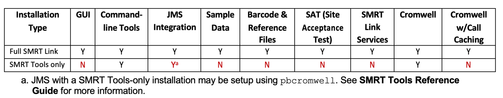
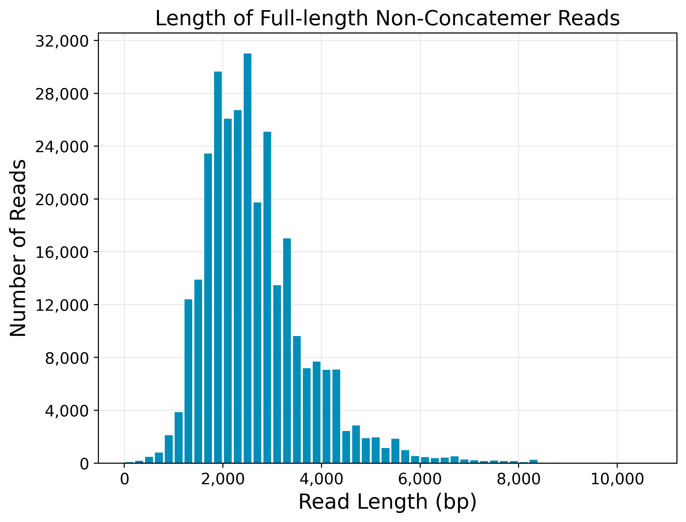
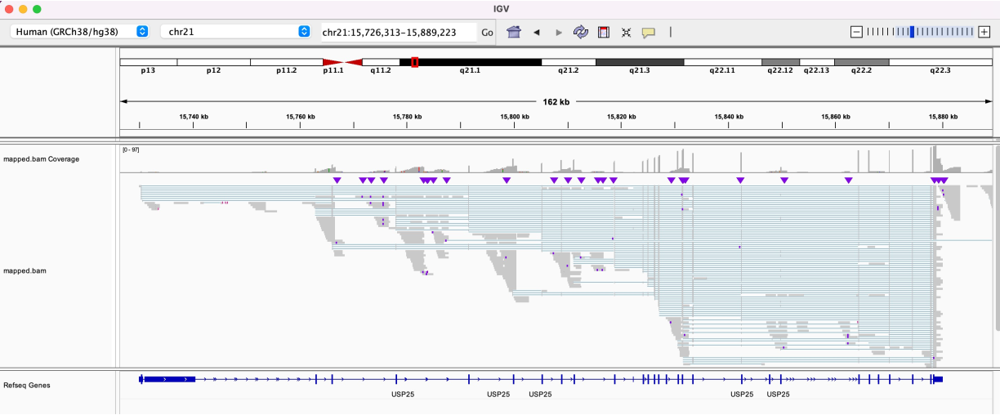
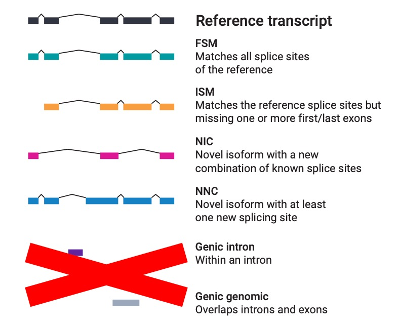
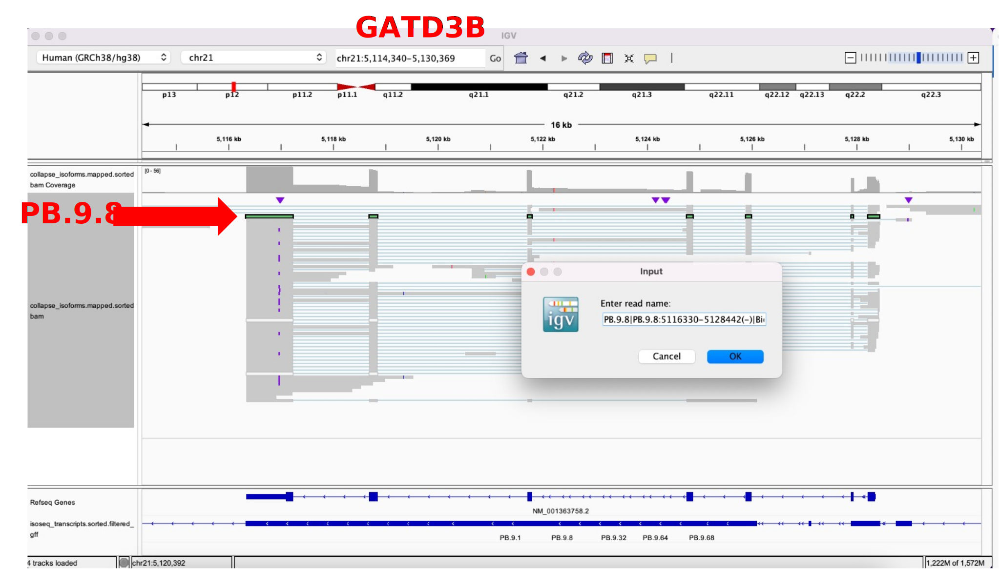
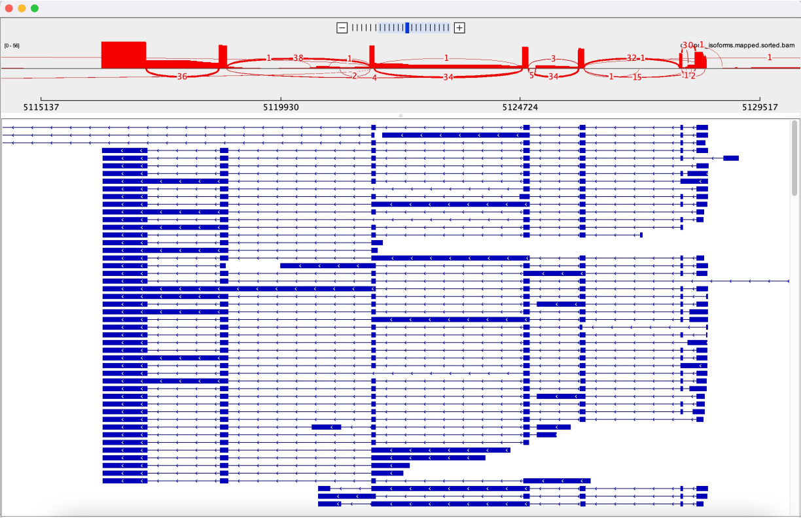
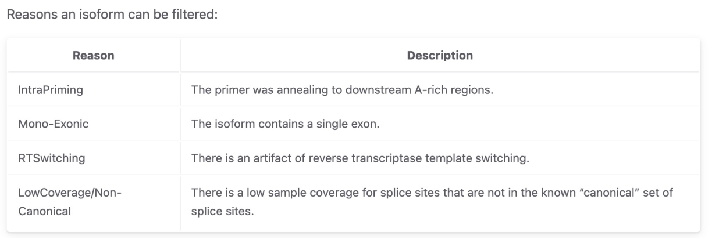
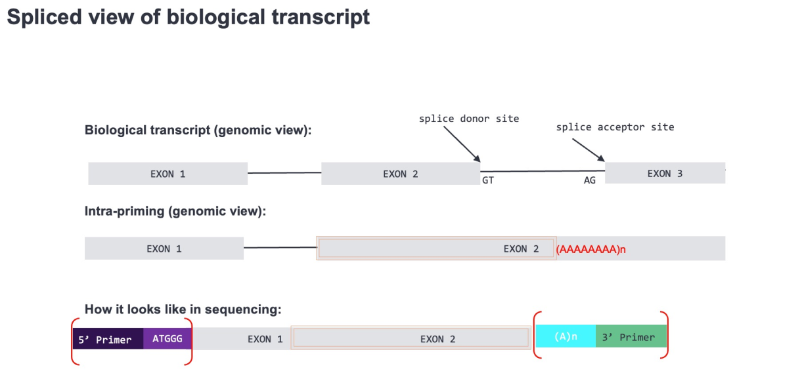
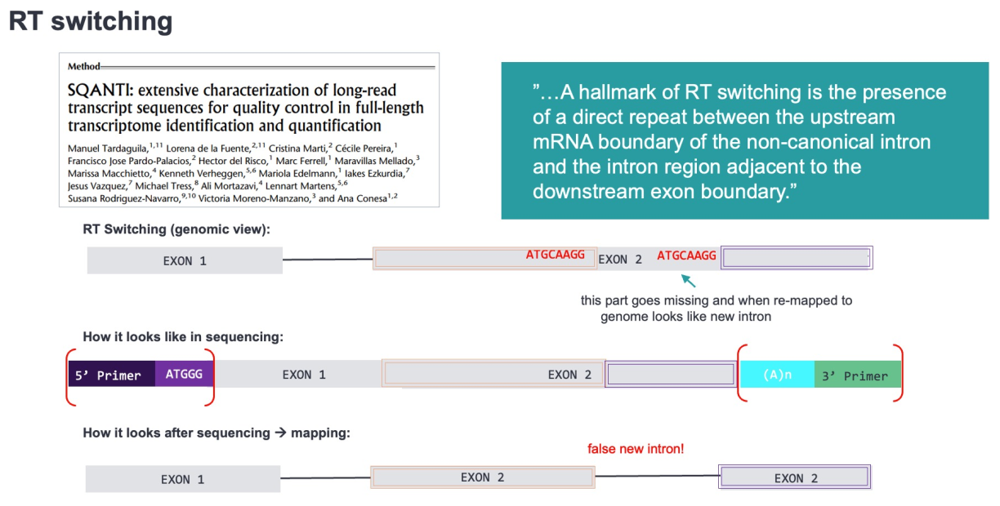

### Learning Objectives:

* Understand key steps and main outputs of Iso-Seq pipeline for Kinnex bulk RNA seq
* Understand how to run Iso-Seq pipeline with `pbcromwell` using Slurm job management system (JMS) on a high-performing computer (HPC)


- [Kinnex high-throughput RNA sequencing kit](#kinnex-high-throughput-rna-sequencing-kit)
- [Pre-setting running environment](#pre-setting-running-environment)
  - [Installing SMRT Link v13 (EA)](#installing-smrt-link-v13-ea)
  - [Updating system `$PATH`](#updating-system-path)
- [Preparing demo dataset](#preparing-demo-dataset)
  - [Demultiplexing HiFi reads](#demultiplexing-hifi-reads)
  - [Decatenating HiFi reads with `skera`](#decatenating-hifi-reads-with-skera)
  - [Downsampling segmented reads](#downsampling-segmented-reads)
- [Key pipeline steps and output](#key-pipeline-steps-and-output)
  - [1. Trimming cDNA primer barcodes and amplicon demultiplexing](#1-trimming-cdna-primer-barcodes-and-amplicon-demultiplexing)
  - [2. Trimming polyA tails with `isoseq refine`](#2-trimming-polya-tails-with-isoseq-refine)
  - [3. Generating transcripts consensus with `isoseq cluster2`](#3-generating-transcripts-consensus-with-isoseq-cluster2)
  - [4. Mapping transcripts consensus to reference genome with `pbmm2`](#4-mapping-transcripts-consensus-to-reference-genome-with-pbmm2)
  - [5. Merging transcripts consensus derived from same isoform with `isoseq collapse`](#5-merging-transcripts-consensus-derived-from-same-isoform-with-isoseq-collapse)
  - [6. Isoform classification and filtering using `pigeon`](#6-isoform-classification-and-filtering-using-pigeon)
- [Executing Iso-Seq workflow using `pbcromwell`](#executing-iso-seq-workflow-using-pbcromwell)


## Kinnex high-throughput RNA sequencing kit

The pipeline used in this session is for BFX analysis of high-throughput bulk RNA sequencing data using [Kinnex RNA Kits](https://www.pacb.com/press_releases/pacbio-announces-kinnex-rna-kits-further-scaling-hifi-sequencing-in-full-length-rna-single-cell-rna-and-16s-rrna-applications/) PacBio recently released.

<!--
### setting up conda environment

```bash
mamba activate cumed_workshop

mamba install isoseq=4.0.0
mamba install pbskera=1.1.0
mamba install pbpigeon=1.1.0

# Version changelog
# 4.0.0
# Rename isoseq3 to isoseq
# Add new tool isoseq cluster2
# ...
```
-->

## Pre-setting running environment

### Installing SMRT Link v13 (EA)

With full installation of SMRT Link, user could access all command line tools needed for this demo. Besides, instead of a full SMRT Link installation with user interface and other modules, user could opt to only install command line with:

```bash
export SMRT_ROOT=/home/ubuntu/software/smrtlink
./smrtlink-${VERSION}.run --rootdir $SMRT_ROOT --smrttools-only
```

<p align="center">

</p>

In this hands-on session, we only need command line tools of SMRT Link. **Full SMRT Link has already been installed on workshop servers**.

### Updating system `$PATH` 

Add SMRT Link smrttools `bin` directory to $PATH env.

```bash
export SMRT_ROOT=/home/ubuntu/software/smrtlink
export PATH=$SMRT_ROOT/install/smrtlink-release_13.0.0.203030/bundles/smrttools/current/private/otherbins/all/bin:$PATH
```

## Preparing demo dataset

### Demultiplexing HiFi reads

To increase the throughput of Kinnex kit, multiplexing is done on both Kinnex adapter level (barcoded SMRTbell adapters) and cDNA primer level (barcoded cDNA primers).

<p align="center">

</p>

HiFi reads demultiplexing is based on barcodes attached to SMRTbell adapters. HiFi reads demultiplexing is straight-forward and is usually done on-instrument or via SMRT Link data utility modules without too much BFX tweaks, therefore, we will skip it in this workshop and start from demultiplexed HiFi reads with Kinnex barcoded adapter trimmed.

### Decatenating HiFi reads with `skera` 

With demultiplexed HiFi reads, `skera` is the tool used for segmenting out concatnated sequences of cDNA amplicons in Kinnex assay. It uses HiFi bam as input and emits segmented reads (S-reads). S-reads are sequences of cDNA amplicons.

As it needs full set of HiFi reads as input and usually could be done using SMRT Link workflows without pains, therefore, **this step is skipped but with down-sampled segmented reads provided for attendees to use**.

General skera commands used by SMRT Link workflow is included here for attendees' reference.

```bash
skera --version
# skera 1.2.0
# 
# Using:
#   skera    : 1.2.0 (commit v1.2.0)
#   pbbam    : 2.5.0 (commit v2.5.0)
#   pbcopper : 2.4.0 (commit v2.4.0)
#   boost    : 1.76
#   htslib   : 1.17
#   zlib     : 1.2.11


# m84041_231023_043708_s4.hifi_reads.bcM0002.bam: demultiplexed HiFi bam
# MAS-Seq_Adapter_v3/mas8_primers.fasta: barcodes of cDNA primers for deconcatenation
# segmented.bam: output segmented S-reads bam
skera split \
  --log-level INFO \
  --log-file skera.log \
  -j 8 \
  m84041_231023_043708_s4.hifi_reads.bcM0002.bam \
  MAS-Seq_Adapter_v3/mas8_primers.fasta \
  segmented.bam
```

### Downsampling segmented reads

The dataset we used for this hands-on session is downsampled from UHRR dataset we just demonstrated in SMRT Link. Specifically, the segmented S-reads were aligned to GRCh38 and reads mapping to chr21 were selected. The reason we chose chr21 is because it is the shortest human chromosome based on [GRCh38.p14](https://www.ncbi.nlm.nih.gov/grc/human/data) and [CHM13-T2T v2.0](https://www.ncbi.nlm.nih.gov/datasets/genome/GCA_009914755.4/), choosing S-reads aligned chr21 will give us a toy Kinnex bulk Iso-Seq dataset with enough coverage for downstream FL isoform profiling (chr21).

<!--
```bash
/sg/collections/xliu/downsample_CUMED_workshop/kinnex

cp -d /home/smrtuser/SL5beta/userdata/jobs_root/0000/0000006/0000006278/outputs/segmented.bam

# pbmm2_isoseq_run.sh
/home/xliu/softwares/pacbio/smrtlinkv13_ea_smrttools/smrtcmds/bin/pbmm2 align \
    --num-threads 32 \
    --preset ISOSEQ \
    --bam-index BAI \
    ~/CUMED_BFX_workshop/01.wdl_humanwgs/dataset/GRCh38/human_GRCh38_no_alt_analysis_set.fasta.mmi \
    segmented.bam \
    segmented.GRCh38.bam

quick_sub_more pbmm2_isoseq_sub.sh 32 4096m compute 'bash pbmm2_isoseq_run.sh'

conda activate cumed_workshop
    samtools sort \
    -T segmented.GRCh38.sort.tmp \
    --write-index \
    -@16 \
    -o segmented.GRCh38.sorted.bam \
    segmented.GRCh38.bam

samtools index segmented.GRCh38.sorted.bam

samtools view -h -@16 segmented.GRCh38.sorted.bam chr21 | samtools view -b -h -@16 -o UHRR.chr21.sorted.bam
samtools index -@16 UHRR.chr21.sorted.bam
/home/xliu/softwares/pacbio/smrtlinkv13_ea_smrttools/smrtcmds/bin/pbindex UHRR.chr21.sorted.bam

# fetched downsampled S-reads from unmapped HiFi bam 

# NOTE: by default, bamsieve selects skera S-reads from same set of ZMWs as reads mapped to chr21 in UHRR.chr21.sorted.bam. In each ZMW, reads aligned to different chrs concated together for sequencing. Therefore, by subsetting ZMWs, reads aligned to other chrs sharing same set of ZMWs as targeted chr21 S-reads would also be selected. 
/home/xliu/softwares/pacbio/smrtlinkv13_ea_smrttools/smrtcmds/bin/bamsieve --include UHRR.chr21.sorted.bam segmented.bam UHRR.chr21.zmws.bam

# Use --subreads option as a work-round to let bamsieve select by read names
/home/xliu/softwares/pacbio/smrtlinkv13_ea_smrttools/smrtcmds/bin/bamsieve --include UHRR.chr21.sorted.bam --subreads segmented.bam UHRR.chr21.bam

# Identical set of read names
sha1sum <(samtools view -@8 UHRR.chr21.sorted.bam | cut -f1 | sort | uniq) <(samtools view -@8 UHRR.chr21.bam | cut -f1 | sort | uniq)
bd3a2e6be4c58903a09af818e1e244cccf01ded5  /dev/fd/63
bd3a2e6be4c58903a09af818e1e244cccf01ded5  /dev/fd/62
```
-->

## Key pipeline steps and output

### 1. Trimming cDNA primer barcodes and amplicon demultiplexing

As mentioned above, multiplexing of Kinnex kit happens in two places. Besides Kinnex adapter, primers used for sample cDNA amplification were also barcoded. These barcodes also need to be trimmed for demultiplexing of cDNA amplicons (into different samples).

`~/CUMED_BFX_workshop/02.pbcromwell_isoseq/Iso-Seq_v2_Barcoded_cDNA_Primers/` contains sequence file (.fasta) for Kinnex Iso-Seq v2 cDNA primer barcodes. PacBio barcodes trimming and demultiplexing program [lima](https://lima.how/) will use this 

In the Kinnex bulk Iso-Seq BFX pipeline, `lima` tries to infer the used barcodes subset based on matching profile with `--peek-guess` option.

```bash
# ~/CUMED_BFX_workshop/02.pbcromwell_isoseq/hacked_run
export SMRT_ROOT=/home/ubuntu/software/smrtlink
export PATH=$SMRT_ROOT/install/smrtlink-release_13.0.0.203030/bundles/smrttools/current/private/otherbins/all/bin:$PATH

mkdir -p ~/CUMED_BFX_workshop/02.pbcromwell_isoseq/hacked_run/call_lima
cd ~/CUMED_BFX_workshop/02.pbcromwell_isoseq/hacked_run/call_lima

# cDNA primer barcodes used by Kinnex bulk Iso-Seq kit
# Iso-Seq_v2_Barcoded_cDNA_Primers

lima --version
# lima 2.9.0
# 
# Using:
#   lima      : 2.9.0 (commit v2.9.0)
#   pbbam     : 2.5.0 (commit v2.5.0)
#   pbcopper  : 2.4.0 (commit v2.4.0)
#   boost     : 1.76
#   htslib    : 1.17
#   zlib      : 1.2.11

time lima \
  -j 4 \
  --log-level INFO \
  --log-file lima-isoseq.log \
  --isoseq \
  --peek-guess \
  --ignore-biosamples \
  --overwrite-biosample-names \
  --dump-removed \
  ~/CUMED_BFX_workshop/02.pbcromwell_isoseq/data/UHRR.chr21.bam \
  ~/CUMED_BFX_workshop/02.pbcromwell_isoseq/Iso-Seq_v2_Barcoded_cDNA_Primers/IsoSeq_v2_primers_12.fasta \
  fl_transcripts.bam

# real	0m52.294s
# user	3m10.280s
# sys	0m7.828s

#  --peek-guess
# lima Try to infer the used barcodes subset.

cat fl_transcripts.lima.guess | column -t
# IdxFirst  IdxCombined  IdxFirstNamed    IdxCombinedNamed  NumZMWs  MeanScore  Picked
# 0         12           IsoSeqX_bc01_5p  IsoSeqX_3p        47470    99         1
# 1         12           IsoSeqX_bc02_5p  IsoSeqX_3p        1        84         0
# 2         12           IsoSeqX_bc03_5p  IsoSeqX_3p        1        91         0
# 10        12           IsoSeqX_bc11_5p  IsoSeqX_3p        1        100        0

# fl_transcripts.IsoSeqX_bc01_5p--IsoSeqX_3p.bam
# fl_transcripts.IsoSeqX_bc01_5p--IsoSeqX_3p.bam.pbi

cat fl_transcripts.lima.summary
# Reads input                    : 318883
# Reads above all thresholds (A) : 302453
# Reads below any threshold  (B) : 16430
# 
# Read marginals for (B):
# Below min length               : 17
# Below min score                : 5
# Below min end score            : 8496
# Below min passes               : 2
# Below min score lead           : 0
# Below min ref span             : 13511
# Without SMRTbell adapter       : 0
# Wrong different pair           : 0
# Undesired 5p--5p pairs         : 4427
# Undesired 3p--3p pairs         : 6165
# 
# Reads for (A):
# With same pair                 : 0
# With different pair            : 302453
```

### 2. Trimming polyA tails with `isoseq refine` 

`isoseq refine` trims polyA tails of cDNA sequences and generates [FLNC: full-length non-concatemer reads](https://isoseq.how/clustering/cli-workflow.html#step-3---refine).

```bash
mkdir -p ~/CUMED_BFX_workshop/02.pbcromwell_isoseq/hacked_run/call_isoseq_refine
cd ~/CUMED_BFX_workshop/02.pbcromwell_isoseq/hacked_run/call_isoseq_refine

isoseq --version
# isoseq 4.1.0 (commit v4.1.0)
# 
# Using:
#   pbbam     : 2.5.0 (commit v2.5.0)
#   pbcopper  : 2.4.0 (commit v2.4.0)
#   pbmm2     : 1.13.1 (commit v1.13.1)
#   minimap2  : 2.26
#   parasail  : 2.4.2
#   boost     : 1.76
#   htslib    : 1.17
#   zlib      : 1.2.11

time isoseq \
  refine \
  --log-level INFO \
  -j 4 \
  --require-polya \
  ~/CUMED_BFX_workshop/02.pbcromwell_isoseq/hacked_run/call_lima/fl_transcripts.IsoSeqX_bc01_5p--IsoSeqX_3p.bam \
  ~/CUMED_BFX_workshop/02.pbcromwell_isoseq/Iso-Seq_v2_Barcoded_cDNA_Primers/IsoSeq_v2_primers_12.fasta \
  flnc.bam

# real	1m35.760s
# user	6m15.576s
# sys	0m3.696s

python3 -m pbcoretools.tasks.isoseq.collect_files \
  flnc.bam \
  --flnc-bam flnc.bam \
  --flnc-report flnc.report.csv \
  --single-sample \
  --datastore isoseq_refine.datastore.json

# did nothing but updating "UniqueId" field of pbds:ConsensusReadSet head
dataset \
  --log-level DEBUG \
  --strict \
  create \
  --trustCounts \
  flnc_ccs_all_samples.consensusreadset.xml \
  flnc.consensusreadset.xml

python3 -m pbcoretools.tasks.gather \
  flnc_summary_all_samples.report.json \
  flnc.filter_summary.report.json

python3 -m pbreports.report.isoseq_primers \
  --log-level INFO \
  --log-file pbreports.log \
  -o isoseq_primers.report.json \
  ~/CUMED_BFX_workshop/02.pbcromwell_isoseq/hacked_run/call_lima/fl_transcripts.consensusreadset.xml \
  flnc_summary_all_samples.report.json \
  flnc_ccs_all_samples.consensusreadset.xml

python3 -m pbcoretools.tasks.memory.get_dataset_size \
  flnc_ccs_all_samples.consensusreadset.xml \
  --skip-counts \
  --get-index-size
```

Output of `isoseq refine` is located at: `~/CUMED_BFX_workshop/02.pbcromwell_isoseq/hacked_run/call_isoseq_refine`. Attendees could check output files, e.g.:

1. `flnc.filter_summary.report.json` for relevant numbers:

```json
{
    "_comment": "Created by pbcopper v2.4.0",
    "attributes": [
        {
            "id": "sample_name",
            "name": "Sample Name",
            "value": "BioSample_1"
        },
        {
            "id": "num_reads_fl",
            "name": "Full-Length Reads",
            "value": 302453
        },
        {
            "id": "num_reads_flnc",
            "name": "Full-Length Non-Chimeric Reads",
            "value": 301733
        },
        {
            "id": "num_reads_flnc_polya",
            "name": "Full-Length Non-Chimeric Reads with Poly-A Tail",
            "value": 301515
        }
    ],
    "dataset_uuids": [],
    "id": "isoseq_refine",
    "plotGroups": [],
    "tables": [],
    "title": "Iso-Seq Refine Report",
    "uuid": "b2d461c9-924b-496d-81db-11816699243c",
    "version": "1.0.1"
}
```

2. `fulllength_nonconcatemer_readlength_hist.png`, for finalized FLNC read length distribution.

<p align="left">

</p>

3. `flnc.report.csv`, for detailed per-read profile.

```
id,strand,fivelen,threelen,polyAlen,insertlen,primer
m84041_231023_043708_s4/234885674/ccs/15167_16570,+,6,6,30,1403,IsoSeqX_bc01_5p--IsoSeqX_3p
m84041_231023_043708_s4/234884455/ccs/17581_20379,+,6,6,105,2798,IsoSeqX_bc01_5p--IsoSeqX_3p
m84041_231023_043708_s4/246027830/ccs/4806_8003,+,6,3,27,3197,IsoSeqX_bc01_5p--IsoSeqX_3p
m84041_231023_043708_s4/251662086/ccs/5543_8309,+,6,6,30,2766,IsoSeqX_bc01_5p--IsoSeqX_3p
m84041_231023_043708_s4/251661925/ccs/4818_7598,+,6,6,29,2780,IsoSeqX_bc01_5p--IsoSeqX_3p
m84041_231023_043708_s4/251662345/ccs/14716_18685,+,6,6,32,3969,IsoSeqX_bc01_5p--IsoSeqX_3p
m84041_231023_043708_s4/251662771/ccs/9842_11533,+,6,6,33,1691,IsoSeqX_bc01_5p--IsoSeqX_3p
m84041_231023_043708_s4/251662239/ccs/12711_14772,+,6,5,28,2061,IsoSeqX_bc01_5p--IsoSeqX_3p
...
```

### 3. Generating transcripts consensus with `isoseq cluster2`

Comparing to its predecessor, `isoseq cluster2` is a memory-efficient alternative supporting high-throughput input of Kinnex FL RNA sequencing.

`isoseq cluster2` took ~10 mins to run on the demo dataset, therefore the result file: `transcripts.bam` has already been provided under: `~/CUMED_BFX_workshop/02.pbcromwell_isoseq/hacked_run/call_isoseq_cluster2/`

```bash
mkdir -p ~/CUMED_BFX_workshop/02.pbcromwell_isoseq/hacked_run/call_isoseq_cluster2
cd ~/CUMED_BFX_workshop/02.pbcromwell_isoseq/hacked_run/call_isoseq_cluster2

time dataset consolidate \
 ~/CUMED_BFX_workshop/02.pbcromwell_isoseq/hacked_run/call_isoseq_refine/flnc_ccs_all_samples.consensusreadset.xml \
 ~/CUMED_BFX_workshop/02.pbcromwell_isoseq/hacked_run/call_isoseq_refine/flnc.bam ~/CUMED_BFX_workshop/02.pbcromwell_isoseq/hacked_run/call_isoseq_refine/flnc.consensusreadset.xml

# real	0m15.865s
# user	0m36.037s
# sys	0m5.781s

# attendees could skip this step but using result file: transcripts.bam for next step
time isoseq \
  cluster2 \
  --log-level INFO \
  --log-file isoseq_cluster2.log \
  -j 4 \
  ~/CUMED_BFX_workshop/02.pbcromwell_isoseq/hacked_run/call_isoseq_refine/flnc.bam \
  transcripts.bam

# real	12m59.219s
# user	39m50.227s
# sys	10m33.296s

time python3 -m pbreports.tasks.isoseq_summarize \
  --log-level INFO \
  transcripts.cluster_report.csv \
  transcripts.bam \
  ~/CUMED_BFX_workshop/02.pbcromwell_isoseq/hacked_run/call_isoseq_refine/flnc_ccs_all_samples.consensusreadset.xml \
  --csv-out transcripts.fl_counts.csv

# real	0m6.197s
# user	0m4.139s
# sys	0m0.168s

# add prefix (Default: BioSample_1) to seq id
time bam2fasta \
  --num-threads 4 \
  --with-biosample-prefix \
  -u --output transcripts \
  transcripts.bam

# real	0m0.357s
# user	0m0.491s
# sys	0m0.085s


# add a sample-specific and meaningful prefix (e.g., default 'BioSample_1') to every transcript names.
time python3 -m pbcoretools.tasks.isoseq.consolidate_transcripts \
  --log-level INFO \
  ~/CUMED_BFX_workshop/02.pbcromwell_isoseq/hacked_run/call_isoseq_refine/flnc.consensusreadset.xml \
  transcripts.bam \
  combined.transcriptset.xml \
  resources.hq.json

# real	0m5.228s
# user	0m4.048s
# sys	0m1.477s

dataset \
  --log-level INFO \
  absolutize \
  combined.transcriptset.xml

time dataset --skipCounts create \
  --type TranscriptSet \
  transcripts.transcriptset.xml \
  transcripts.bam

# real	0m0.276s
# user	0m0.216s
# sys	0m0.060s

time python3 -m pbreports.report.isoseq \
  --log-level INFO \
  transcripts.transcriptset.xml \
  isoseq.report.json

# real	0m1.126s
# user	0m0.948s
# sys	0m0.178s
```

### 4. Mapping transcripts consensus to reference genome with `pbmm2` 

This step comes before `isoseq collapse` for collapsing multiple transcripts consensus derived from same isoform. `/home/ubuntu/CUMED_BFX_workshop/02.pbcromwell_isoseq/Human_hg38_Gencode_v39/` is the reference dataset comes together with SMRT Link (need to be installed).

```bash
# still under folder of isoseq cluster2 
cd ~/CUMED_BFX_workshop/02.pbcromwell_isoseq/hacked_run/call_isoseq_cluster2/

time pbmm2 align \
    --sort \
    --min-gap-comp-id-perc 95.0 \
    --min-length 50 \
    --sample "" \
    --report-json mapping_stats.report.json \
    --preset ISOSEQ \
    -j 4 \
    --log-level DEBUG \
    --log-file pbmm2.log \
    /home/ubuntu/CUMED_BFX_workshop/02.pbcromwell_isoseq/Human_hg38_Gencode_v39/Human_hg38_Gencode_v39.referenceset.xml \
    combined.transcriptset.xml \
    mapped.bam

# real	2m0.909s
# user	4m20.701s
# sys	0m34.101s
```

Let's view transcripts consensus derived from `isoseq cluster2` mapping (pbmm2) to reference genome (`~/CUMED_BFX_workshop/02.pbcromwell_isoseq/hacked_run/call_isoseq_cluster2/mapped.bam`) in IGV. Here, we use USP25, a >150k bp gene as example, there are multiple consensus sequences which are similar/identical, indicating over-splitted clusters (will be merged in `isoseq collapse`).

<p align="left">

</p>


### 5. Merging transcripts consensus derived from same isoform with `isoseq collapse` 

After this step, Iso-Seq pipeline emit unique sequence for each full-length isoform.

```bash
mkdir -p ~/CUMED_BFX_workshop/02.pbcromwell_isoseq/hacked_run/call_isoseq_collapse
cd ~/CUMED_BFX_workshop/02.pbcromwell_isoseq/hacked_run/call_isoseq_collapse

# --do-not-collapse-extra-5exons: do not collapse 5' shorter transcripts which miss one or multiple 5' exons

# defaults:
# --max-fuzzy-junction 5: ignore mismatches or indels shorter than or equal to 5
# --min-aln-coverage 0.99: >= 99% of the query sequence length should be included in alignments against the sequence match (not too many soft/hard-clips).
# --min-aln-identity 0.95

time isoseq collapse \
    --log-level INFO \
    --alarms alarms.json \
    -j 4 \
    --do-not-collapse-extra-5exons \
    --min-aln-coverage 0.99 \
    --min-aln-identity 0.95 \
    --max-fuzzy-junction 5 \
    /home/ubuntu/CUMED_BFX_workshop/02.pbcromwell_isoseq/hacked_run/call_isoseq_cluster2/mapped.bam \
    /home/ubuntu/CUMED_BFX_workshop/02.pbcromwell_isoseq/hacked_run/call_isoseq_refine/flnc_ccs_all_samples.consensusreadset.xml \
    collapse_isoforms.gff

# real	0m2.140s
# user	0m2.339s
# sys	0m0.737s
```

### 6. Isoform classification and filtering using `pigeon`

After generating full-length isoform sequences, we use [pigeon](https://isoseq.how/classification/pigeon.html) to classify isoform based on their matching file to known isoforms and exclude low quality isoforms. Pigeon is based off [SQANTI3](https://github.com/ConesaLab/SQANTI3).

<p align="center">

</p>

```bash
mkdir -p /home/ubuntu/CUMED_BFX_workshop/02.pbcromwell_isoseq/hacked_run/call_pigeon
cd /home/ubuntu/CUMED_BFX_workshop/02.pbcromwell_isoseq/hacked_run/call_pigeon

time dataset \
  --log-level INFO \
  --log-file dataset.log \
  absolutize \
  --output-xml absolutized.referenceset.xml \
  ~/CUMED_BFX_workshop/02.pbcromwell_isoseq/Human_hg38_Gencode_v39/Human_hg38_Gencode_v39.referenceset.xml

# real	0m0.274s
# user	0m0.231s
# sys	0m0.044s

pigeon --version
# pigeon 1.1.0 (commit -v1.1.0-15-g89b5b23)
# 
# Using:
#   pbbam     : 2.5.0 (commit v2.5.0)
#   pbcopper  : 2.4.0 (commit v2.4.0)
#   boost     : 1.76
#   htslib    : 1.17
#   zlib      : 1.2.11

time pigeon sort \
  --log-level INFO \
  --log-file pigeon-sort.log \
  -o isoseq_transcripts.sorted.gff \
  ~/CUMED_BFX_workshop/02.pbcromwell_isoseq/hacked_run/call_isoseq_collapse/collapse_isoforms.gff

# real	0m0.812s
# user	0m0.770s
# sys	0m0.029s

time pigeon classify \
  --log-level INFO \
  --log-file pigeon-classify.log \
  -j 4 \
  --out-dir . \
  --out-prefix isoseq \
  --flnc ~/CUMED_BFX_workshop/02.pbcromwell_isoseq/hacked_run/call_isoseq_collapse/collapse_isoforms.flnc_count.txt \
  --ref absolutized.referenceset.xml \
  isoseq_transcripts.sorted.gff

# real	0m35.326s
# user	0m56.952s
# sys	0m1.467s

time pigeon filter \
  --log-level INFO \
  --log-file pigeon-filter.log \
  --isoforms isoseq_transcripts.sorted.gff \
  isoseq_classification.txt

# real	0m0.733s
# user	0m0.687s
# sys	0m0.045s

time pigeon report \
  --log-level INFO \
  --log-file pigeon-report.log \
  isoseq_classification.filtered_lite_classification.txt \
  isoseq_saturation.txt

# real	0m0.139s
# user	0m0.102s
# sys	0m0.038s
```

Final pigeon output classification file is located at `/home/ubuntu/CUMED_BFX_workshop/02.pbcromwell_isoseq/hacked_run/call_pigeon/isoseq_classification.filtered_lite_classification.txt`, with columns and example values in below table: a FSM isoform with alternative Transcription Start Site (TSS) ("subcategory": "alternative_5end") and "diff_to_TSS" values provided. "fl_assoc" column keeps the number of reads (FLNC PacBio HiFi reads) supporting this isoform. For more info, please refer to SQANTI3 [docs](https://github.com/ConesaLab/SQANTI3/wiki/Understanding-the-output-of-SQANTI3-QC#glossary-of-classification-file-columns-classificationtxt).

|columns|example_value|
|---|---|
|isoform|PB.9.8|
|chrom|chr21|
|strand|-
|length|1668|
|exons|7
|structural_category|full-splice_match|
|associated_gene|GATD3B|
|associated_transcript|ENST00000620528.5|
|ref_length|1584|
|ref_exons|7
|diff_to_TSS|-73|
|diff_to_TTS|-11|
|diff_to_gene_TSS|-29|
|diff_to_gene_TTS|11|
|subcategory|alternative_5end|
|RTS_stage|FALSE|
|all_canonical|canonical|
|min_sample_cov|NA|
|min_cov|NA|
|min_cov_pos|NA|
|sd_cov|NA|
|FL.BioSample_1|852|
|FL_TPM.BioSample_1|3597.092041|
|FL_TPM.BioSample_1_log10|3.555952|
|n_indels|NA|
|n_indels_junc|NA|
|bite|FALSE|
|iso_exp|NA|
|gene_exp|NA|
|ratio_exp|NA|
|FSM_class|C
|coding|non_coding|
|ORF_length|NA|
|CDS_length|NA|
|CDS_start|NA|
|CDS_end|NA|
|CDS_genomic_start|NA|
|CDS_genomic_end|NA|
|predicted_NMD|NA|
|perc_A_downstream_TTS|15|
|seq_A_downstream_TTS|ATTCATCTGTGTGTTCAGGG|
|dist_to_CAGE_peak|NA|
|within_CAGE_peak|FALSE|
|dist_to_polyA_site|NA|
|within_polyA_site|NA|
|polyA_motif|NA|
|polyA_dist|NA|
|polyA_motif_found|NA|
|ORF_seq|NA|
|ratio_TSS|NA|
|fl_assoc|852|
|cell_barcodes|NA|


If we `pbmm2` final isoform sequences (from `isoseq collapse`) to reference genome: 

```bash
time pbmm2 align \
    --sort \
    --preset ISOSEQ \
    -j 4 \
    /home/ubuntu/CUMED_BFX_workshop/02.pbcromwell_isoseq/Human_hg38_Gencode_v39/Human_hg38_Gencode_v39.referenceset.xml \
    /home/ubuntu/CUMED_BFX_workshop/02.pbcromwell_isoseq/hacked_run/call_isoseq_collapse/collapse_isoforms.fasta \
    collapse_isoforms.mapped.sorted.bam

# >|> 20231125 10:43:23.016 -|- WARN -|- CheckPositionalArgs -|- 0x7fd42870bc40|| -|- Input is FASTA. Output BAM file cannot be used for polishing with GenomicConsensus!

# real	8m25.139s
# user	4m51.736s
# sys	0m24.837s
```

Load the alignment to IGV and select corresponding isoform sequences (name is a bit different in `isoseq collapse` fasta): "PB.9.8|PB.9.8:5116330-5128442(-)|BioSample_1_transcript/71730"

<p align="center">

</p>

Besides this known isoform, isoseq also detected a bunch of novel isoforms associating to GATD3B (NM_001363758.2):

```bash
awk -F"\t" '$7=="GATD3B"{print $6}' isoseq_classification.filtered_lite_classification.txt | sort | uniq -c
      8 full-splice_match
     12 incomplete-splice_match
     14 novel_in_catalog
     18 novel_not_in_catalog
```

With Sashimi plot showing structures of GATD3B associated isoforms:

<p align="center">

</p>

Attendees could view pigeon output JSON file: `/home/ubuntu/CUMED_BFX_workshop/02.pbcromwell_isoseq/hacked_run/call_pigeon/isoseq_classification.filtered.report.json` for more useful numbers:

```json
{
    "_comment": "Created by pbcopper v2.4.0",
    "attributes": [],
    "dataset_uuids": [],
    "id": "classification_summary",
    "plotGroups": [],
    "tables": [
        {
            "columns": [
                {
                    "header": "Sample Name",
                    "id": "sample_name",
                    "values": [
                        "BioSample_1"
                    ]
                },
                {
                    "header": "Total Unique Genes",
                    "id": "total_unique_genes",
                    "values": [
                        370
                    ]
                },
                {
                    "header": "Total Unique Genes, known genes only",
                    "id": "total_unique_genes_known",
                    "values": [
                        280
                    ]
                },
                {
                    "header": "Total Unique Transcripts",
                    "id": "total_unique_transcripts",
                    "values": [
                        3439
                    ]
                },
                {
                    "header": "Total Unique Transcripts, known transcripts only",
                    "id": "total_unique_transcripts_known",
                    "values": [
                        704
                    ]
                },
                {
                    "header": "FLNC Reads Mapped to Genome",
                    "id": "flnc_mapped_genome",
                    "values": [
                        158235
                    ]
                },
                {
                    "header": "FLNC Reads Confidently Mapped to Transcriptome",
                    "id": "flnc_mapped_transcriptome",
                    "values": [
                        157833
                    ]
                },
                {
                    "header": "FLNC Reads Confidently Mapped to Transcriptome, excluding ribomito",
                    "id": "flnc_mapped_transcriptome_excluding_ribomito",
                    "values": [
                        157833
                    ]
                },
                {
                    "header": "Transcripts classified as Full-splice Matches (FSM)",
                    "id": "transcripts_fsm",
                    "values": [
                        1460
                    ]
                },
                {
                    "header": "Transcripts classified as Incomplete-splice Matches (ISM)",
                    "id": "transcripts_ism",
                    "values": [
                        2785
                    ]
                },
                {
                    "header": "Transcripts classified as Novel In Catalog (NIC)",
                    "id": "transcripts_nic",
                    "values": [
                        1258
                    ]
                },
                {
                    "header": "Transcripts classified as Novel Not In Catalog (NNC)",
                    "id": "transcripts_nnc",
                    "values": [
                        1313
                    ]
                },
                {
                    "header": "Percent of reads classified as Full-splice Matches (FSM)",
                    "id": "percent_reads_fsm",
                    "values": [
                        69.25
                    ]
                },
                {
                    "header": "Percent of reads classified as Incomplete-splice Matches (ISM)",
                    "id": "percent_reads_ism",
                    "values": [
                        20.11
                    ]
                },
                {
                    "header": "Percent of reads classified as Novel In Catalog (NIC)",
                    "id": "percent_reads_nic",
                    "values": [
                        5.93
                    ]
                },
                {
                    "header": "Percent of reads classified as Novel Not In Catalog (NNC)",
                    "id": "percent_reads_nnc",
                    "values": [
                        4.45
                    ]
                }
            ],
            "id": "classification_summary_by_sample",
            "title": ""
        }
    ],
    "title": "Pigeon Classification Summary",
    "uuid": "8eda7b89-4482-4b4b-a9d3-d604437a8ba0",
    "version": "1.0.1"
}
```

For how many isoforms got filtered in `isoseq filter`, attendees could check `/home/ubuntu/CUMED_BFX_workshop/02.pbcromwell_isoseq/hacked_run/call_pigeon/pigeon-filter.log`, for example, ~30% of `isoform collapse` isoforms got excluded because of Intrapriming, RT (reverse transcriptase) Switching and LowCoverage/Non-Canonical:

<p align="center">

</p>


```bash
cat /home/ubuntu/CUMED_BFX_workshop/02.pbcromwell_isoseq/hacked_run/call_pigeon/pigeon-filter.log

| 20231113 09:34:07.317 | INFO | Classifications
| 20231113 09:34:07.317 | INFO |   - Input   : 20015
| 20231113 09:34:07.317 | INFO |   - Passed  : 6980 (34.87%)
| 20231113 09:34:07.317 | INFO |   - Removed : 13035 (65.13%)
| 20231113 09:34:07.317 | INFO | 
| 20231113 09:34:07.317 | INFO | Junctions
| 20231113 09:34:07.317 | INFO |   - Input   : 87297
| 20231113 09:34:07.317 | INFO |   - Passed  : 61454 (70.4%)
| 20231113 09:34:07.317 | INFO |   - Removed : 25843 (29.6%)
| 20231113 09:34:07.317 | INFO | 
| 20231113 09:34:07.317 | INFO | Isoforms
| 20231113 09:34:07.317 | INFO |   - Input   : 87297
| 20231113 09:34:07.317 | INFO |   - Passed  : 61454 (70.4%)
| 20231113 09:34:07.317 | INFO |   - Removed : 25843 (29.6%)
| 20231113 09:34:07.317 | INFO | 
| 20231113 09:34:07.317 | INFO | Filter Reasons
| 20231113 09:34:07.317 | INFO |   - Intrapriming              : 6780 (52.01%)
| 20231113 09:34:07.317 | INFO |   - RT Switching              : 255 (1.956%)
| 20231113 09:34:07.317 | INFO |   - LowCoverage/Non-Canonical : 6000 (46.03%)
| 20231113 09:34:07.317 | INFO |   - Mono-exonic               : 0 (0%)
| 20231113 09:34:07.318 | INFO | 
| 20231113 09:34:07.318 | INFO | Run Time : 730ms 60us 
| 20231113 09:34:07.318 | INFO | CPU Time : 725ms 742us 
| 20231113 09:34:07.318 | INFO | Peak RSS : 0.010 GB
```

For Intrapriming (early dT priming off A-stretch):

<p align="center">

</p>


For RT Switching (RT switching from one repat to the other in the RNA template, a secondary structure bring two repeats closer will enhance this):

<p align="center">

</p>

## Executing Iso-Seq workflow using `pbcromwell`

The whole workflow is built with WDL, hence can be executed using [Cromwell](https://github.com/broadinstitute/cromwell) engine. 

`pbcromwell` is PacBio command-line utility for running Cromwell workflows, plus advanced utilities for interacting directly with a Cromwell server.  It is primarily intended for developers and power users. `pbcromwell` is primarily designed for running workflows distributed and supported by PacBio, but it is written to **handle any valid WDL source (version 1.0)**. What is more, `pbcromwell` does **not** interact with SMRT Link services, so it does not need SMRT Link service to run.

PacBio workflows are expected to be found in the directory of `$SMRT_ROOT/install/smrtlink-release_13.0.0.203030/bundles/smrttools/install/smrttools-release_13.0.0.203030/private/pacbio/pbpipeline-resources`.

Running pipeline for demo dataset using `pbcromwell` took ~20 mins wall time. It has already been executed with results saved at `/home/ubuntu/CUMED_BFX_workshop/02.pbcromwell_isoseq/pbcromwell_run/cromwell_job`:

```bash
# config cromwell to use call-caching and Slurm backend
pbcromwell configure --cache --default-backend SLURM

pbcromwell \
  --log-level INFO \
  --log-file pb_isoseq.log \
  run pb_isoseq \
  -i inputs.json \
  --config cromwell.conf \
  --backend SLURM \
  --queue "compute" \
  --overwrite \
  --output-dir cromwell_job

# finish in 20 mins
# [INFO] 2023-11-13 12:41:10,154Z [pbcromwell.cli] SMRT_PIPELINE_BUNDLE_DIR="/home/ubuntu/software/smrtlink/install/smrtlink-release_13.0.0.203030/bundles/smrttools/install/smrttools-release_13.0.0.203030/private/thirdparty/python3/python3_3.9.6/binwrap/../../../../pacbio/pbpipeline-resources"
# ...
# [INFO] 2023-11-13 13:04:40,367Z [pbcromwell.cli] Max RSS (kB): 53580
# [INFO] 2023-11-13 13:04:40,367Z [pbcromwell.cli] exiting with return code 0 in 1390.50 sec.
```

`input.json` for this demo.

```json
{
	"pb_isoseq.add_memory_mb":0,
	"pb_isoseq.cluster_separately":false,
	"pb_isoseq.eid_barcode":"/home/ubuntu/CUMED_BFX_workshop/02.pbcromwell_isoseq/Iso-Seq_v2_Barcoded_cDNA_Primers/Iso-Seq_v2_Barcoded_cDNA_Primers.barcodeset.xml",
	"pb_isoseq.eid_ccs":"/home/ubuntu/CUMED_BFX_workshop/02.pbcromwell_isoseq/data/UHRR.chr21.consensusreadset.xml",
	"pb_isoseq.eid_ref_dataset":"/home/ubuntu/CUMED_BFX_workshop/02.pbcromwell_isoseq/Human_hg38_Gencode_v39/Human_hg38_Gencode_v39.referenceset.xml",
	"pb_isoseq.filter_min_qv":20,
	"pb_isoseq.isocollapse_max_fuzzy_junction":5,
	"pb_isoseq.log_level":"INFO",
	"pb_isoseq.mapping_min_concordance":95.0,
	"pb_isoseq.mapping_min_coverage":99.0,
	"pb_isoseq.mapping_min_length":50,
	"pb_isoseq.max_nchunks":5,
	"pb_isoseq.nproc":4,
	"pb_isoseq.refine_require_polya":true,
	"pb_isoseq.run_clustering":true,
	"pb_isoseq.tmp_dir":"/home/ubuntu/CUMED_BFX_workshop/02.pbcromwell_isoseq/pbcromwell_run/tmp_dir"
}
```

Attendees could also try to run the pipeline using following commands (with new output folder, e.g., `--output-dir cromwell_job_rerun` and new log file, e.g., `--log-file pb_isoseq_rerun.log`):

```bash
pbcromwell \
  --log-level INFO \
  --log-file pb_isoseq_rerun.log \
  run pb_isoseq \
  -i inputs.json \
  --config cromwell.conf \
  --backend SLURM \
  --queue "compute" \
  --overwrite \
  --output-dir cromwell_job_rerun
```

